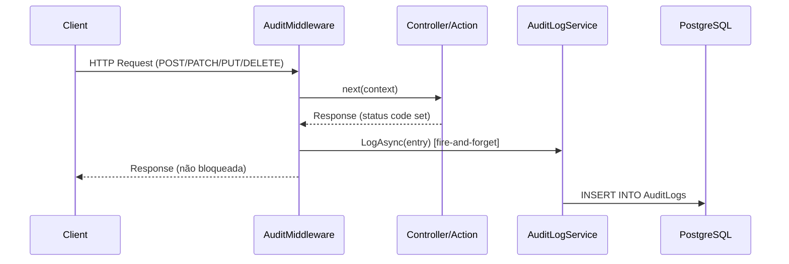
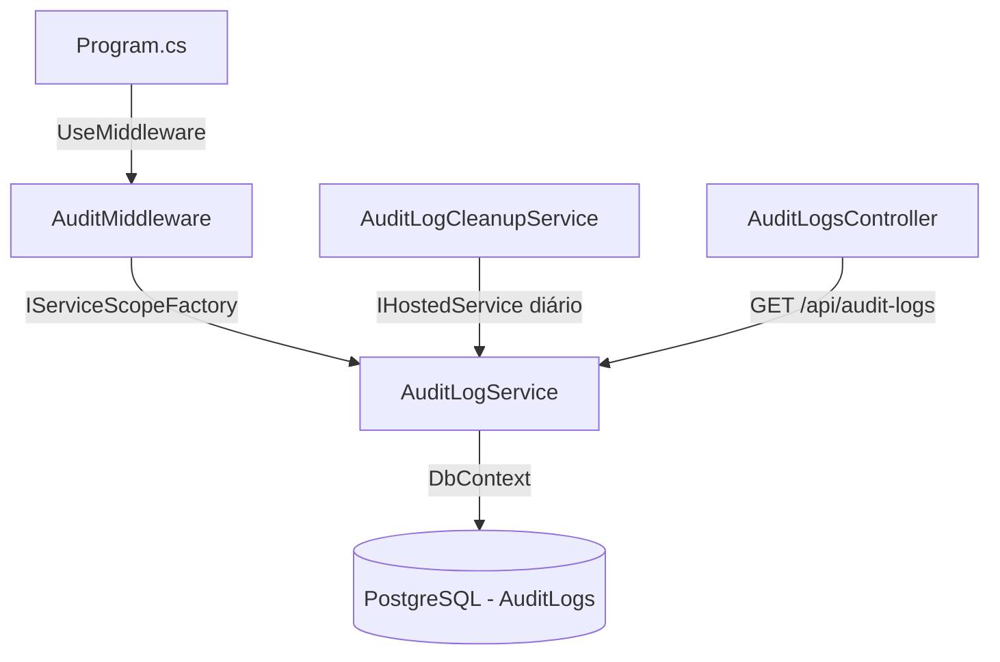

# Design Técnico — Audit Logs

## Overview

O sistema de audit logs registra automaticamente todas as operações de escrita realizadas por usuários autenticados na API do FrogBets. O objetivo é rastreabilidade completa: quem fez o quê, quando, em qual recurso e com qual resultado HTTP.

A implementação usa um **ASP.NET Core Middleware** que intercepta requisições após a execução da action, captura o status code da resposta e persiste um `AuditLog` de forma assíncrona (fire-and-forget), sem impactar a latência das respostas. Um `IHostedService` executa limpeza diária de logs expirados conforme política de retenção configurável.

### Decisões de design

- **Middleware vs. Action Filter**: Middleware foi escolhido por cobrir todos os controllers uniformemente sem necessidade de decorar cada action. Action filters exigiriam anotação em cada controller ou registro global, com risco de omissão.
- **Fire-and-forget com logging de erro**: A persistência do log não deve bloquear nem falhar a resposta ao cliente. Erros de persistência são logados via `ILogger` e descartados silenciosamente para o cliente.
- **Imutabilidade via EF Core**: A entidade `AuditLog` não expõe setters públicos para campos críticos após construção, e o `DbContext` não registra operações de Update/Delete sobre ela. A imutabilidade é reforçada na camada de serviço.
- **Mapeamento semântico estático**: O dicionário de `(HttpMethod, RouteTemplate) → Action` é definido em tempo de compilação no middleware, com fallback para `"<METHOD> <route>"` para rotas não mapeadas.

---

## Architecture





### Posição no pipeline

```
app.UseCors("Frontend")
app.UseRateLimiter()
app.UseAuthentication()
app.UseAuthorization()
app.UseMiddleware<AuditMiddleware>()   ← inserido aqui
app.MapControllers()
```

Registrado após `UseAuthorization()` para que `HttpContext.User` já esteja populado com as claims do JWT.

---

## Components and Interfaces

### AuditMiddleware

Responsável por interceptar requisições, determinar se devem ser auditadas, capturar o status code da resposta e disparar a persistência de forma assíncrona.

```csharp
public class AuditMiddleware
{
    // Invocado para cada requisição
    public async Task InvokeAsync(HttpContext context, IServiceScopeFactory scopeFactory);

    // Retorna true se a requisição deve gerar um AuditLog
    private static bool ShouldAudit(HttpContext context);

    // Resolve o Action semântico a partir do endpoint metadata
    private static string ResolveAction(HttpContext context);

    // Extrai ResourceType e ResourceId do endpoint metadata e route values
    private static (string? resourceType, string? resourceId) ResolveResource(HttpContext context);

    // Persiste o log de forma assíncrona sem bloquear a resposta
    private static void FireAndForgetLog(IServiceScopeFactory scopeFactory,
        AuditLogEntry entry, ILogger logger);
}
```

**Captura do status code**: O middleware usa `OnStarting` callback no `HttpResponse` para capturar o status code antes que os headers sejam enviados ao cliente. Isso evita a necessidade de substituir o stream de resposta.

**Mapeamento de actions**: Dicionário estático `Dictionary<(string method, string template), (string action, string? resourceType)>` populado com todos os 26 endpoints de escrita mapeados no contexto do projeto.

### IAuditLogService / AuditLogService

```csharp
public interface IAuditLogService
{
    Task LogAsync(AuditLogEntry entry);
    Task<AuditLogPage> QueryAsync(AuditLogQuery query);
    Task<int> DeleteExpiredAsync(DateTime cutoff);
}

public record AuditLogEntry(
    Guid? ActorId,
    string ActorUsername,
    string Action,
    string? ResourceType,
    string? ResourceId,
    string HttpMethod,
    string Route,
    int StatusCode,
    string? IpAddress,
    DateTime OccurredAt,
    string? Details = null
);

public record AuditLogQuery(
    Guid? ActorId,
    string? Action,
    DateTime? From,
    DateTime? To,
    int Page,
    int PageSize
);

public record AuditLogPage(
    IReadOnlyList<AuditLogDto> Items,
    int TotalCount,
    int Page,
    int PageSize
);
```

`LogAsync` trunca `Details` para 1000 chars antes de persistir. Nunca lança exceção — erros são capturados internamente e logados via `ILogger`.

### AuditLogsController

```csharp
[ApiController]
[Route("api/audit-logs")]
[Authorize]
public class AuditLogsController : ControllerBase
{
    // GET /api/audit-logs
    [HttpGet]
    public async Task<IActionResult> GetLogs([FromQuery] AuditLogQueryParams query);
}
```

Verifica `User.FindFirstValue("isAdmin") == "true"` e retorna `403 Forbid()` se não for admin.

### AuditLogCleanupService

```csharp
public class AuditLogCleanupService : BackgroundService
{
    // Executa uma vez por dia; calcula cutoff = UtcNow - retentionDays
    protected override async Task ExecuteAsync(CancellationToken stoppingToken);
}
```

Lê `AUDIT_LOG_RETENTION_DAYS` do `IConfiguration` (padrão: 90). Em caso de falha, loga o erro e aguarda o próximo ciclo diário.

---

## Data Models

### Entidade AuditLog

```csharp
// src/FrogBets.Domain/Entities/AuditLog.cs
public class AuditLog
{
    public Guid Id { get; set; }
    public Guid? ActorId { get; set; }
    public string ActorUsername { get; set; } = string.Empty;  // máx 100
    public string Action { get; set; } = string.Empty;         // máx 100
    public string? ResourceType { get; set; }                  // máx 50
    public string? ResourceId { get; set; }                    // máx 100
    public string HttpMethod { get; set; } = string.Empty;     // máx 10
    public string Route { get; set; } = string.Empty;          // máx 200
    public int StatusCode { get; set; }
    public string? IpAddress { get; set; }                     // máx 45 (IPv6)
    public DateTime OccurredAt { get; set; }
    public string? Details { get; set; }                       // máx 1000

    // Navigation (nullable — ActorId pode ser null para anônimos)
    public User? Actor { get; set; }
}
```

### Configuração EF Core (em OnModelCreating)

```csharp
modelBuilder.Entity<AuditLog>(e =>
{
    e.HasKey(a => a.Id);
    e.Property(a => a.ActorUsername).IsRequired().HasMaxLength(100);
    e.Property(a => a.Action).IsRequired().HasMaxLength(100);
    e.Property(a => a.ResourceType).HasMaxLength(50);
    e.Property(a => a.ResourceId).HasMaxLength(100);
    e.Property(a => a.HttpMethod).IsRequired().HasMaxLength(10);
    e.Property(a => a.Route).IsRequired().HasMaxLength(200);
    e.Property(a => a.IpAddress).HasMaxLength(45);
    e.Property(a => a.Details).HasMaxLength(1000);
    e.Property(a => a.OccurredAt).IsRequired();

    // Índices para consultas eficientes
    e.HasIndex(a => a.ActorId);
    e.HasIndex(a => a.Action);
    e.HasIndex(a => a.OccurredAt);

    // FK nullable para User (ActorId pode ser null)
    e.HasOne(a => a.Actor)
        .WithMany()
        .HasForeignKey(a => a.ActorId)
        .OnDelete(DeleteBehavior.SetNull);
});
```

### Migration

Nome: `AddAuditLogs` (seguindo convenção do projeto — última migration existente: `AddTeamSoftDelete`).

### DTO de resposta

```csharp
public record AuditLogDto(
    Guid Id,
    Guid? ActorId,
    string ActorUsername,
    string Action,
    string? ResourceType,
    string? ResourceId,
    string HttpMethod,
    string Route,
    int StatusCode,
    string? IpAddress,
    DateTime OccurredAt,
    string? Details
);
```

### Mapeamento completo de actions

| Método | Rota template | Action semântico | ResourceType | ResourceId |
|--------|--------------|-----------------|--------------|------------|
| POST | /api/auth/login | auth.login | — | — |
| POST | /api/auth/logout | auth.logout | — | — |
| POST | /api/auth/register | auth.register | — | — |
| POST | /api/bets | bets.create | bet | — |
| POST | /api/bets/{id}/cover | bets.cover | bet | {id} |
| DELETE | /api/bets/{id} | bets.cancel | bet | {id} |
| POST | /api/games | games.create | — | — |
| PATCH | /api/games/{id}/start | games.start | game | {id} |
| POST | /api/games/{id}/results | games.register_result | game | {id} |
| POST | /api/invites | invites.create | — | — |
| DELETE | /api/invites/{id} | invites.revoke | invite | {id} |
| POST | /api/players | players.create | — | — |
| POST | /api/players/{id}/stats | players.register_stats | player | {id} |
| POST | /api/teams | teams.create | — | — |
| POST | /api/teams/{teamId}/leader/{userId} | teams.assign_leader | team | {teamId} |
| DELETE | /api/teams/{teamId}/leader | teams.remove_leader | team | {teamId} |
| DELETE | /api/teams/{teamId} | teams.delete | team | {teamId} |
| POST | /api/trades/listings | trades.add_listing | — | — |
| DELETE | /api/trades/listings/{userId} | trades.remove_listing | user | {userId} |
| POST | /api/trades/offers | trades.create_offer | — | — |
| PATCH | /api/trades/offers/{id}/accept | trades.accept_offer | trade_offer | {id} |
| PATCH | /api/trades/offers/{id}/reject | trades.reject_offer | trade_offer | {id} |
| POST | /api/trades/direct | trades.direct_swap | — | — |
| PATCH | /api/users/{id}/team | users.move_team | user | {id} |
| POST | /api/users/{id}/promote | users.promote | user | {id} |
| POST | /api/users/{id}/demote | users.demote | user | {id} |

### Variável de ambiente

```
AUDIT_LOG_RETENTION_DAYS=90
```

Adicionada ao `.env.example`.

---

## Correctness Properties

*A property is a characteristic or behavior that should hold true across all valid executions of a system — essentially, a formal statement about what the system should do. Properties serve as the bridge between human-readable specifications and machine-verifiable correctness guarantees.*

### Property 1: Requisição de escrita gera exatamente um AuditLog com campos corretos

*For any* requisição HTTP com método POST, PATCH, PUT ou DELETE processada pela API, o sistema SHALL persistir exatamente uma entrada de AuditLog contendo ActorId, ActorUsername, Action, HttpMethod, Route, StatusCode e OccurredAt preenchidos corretamente.

**Validates: Requirements 1.1, 2.1, 5.1**

### Property 2: Requisições GET nunca geram AuditLog

*For any* requisição HTTP com método GET processada pela API, o número de entradas na tabela `AuditLogs` SHALL permanecer inalterado após o processamento.

**Validates: Requirements 1.2, 4.1**

### Property 3: StatusCode do AuditLog reflete o status code real da resposta

*For any* requisição auditada com qualquer status code de resposta (2xx, 4xx ou 5xx), o campo `StatusCode` do AuditLog persistido SHALL ser igual ao HTTP status code efetivamente retornado ao cliente.

**Validates: Requirements 1.1, 2.1**

### Property 4: Paginação respeita o limite máximo de pageSize

*For any* consulta com qualquer valor de `pageSize` (incluindo valores acima de 100), o número de itens retornados SHALL ser menor ou igual a `min(pageSize, 100)`.

**Validates: Requirements 4.4**

### Property 5: Limpeza remove exatamente os logs expirados e preserva os válidos

*For any* conjunto de AuditLogs com timestamps variados e qualquer valor de `retentionDays`, após executar `DeleteExpiredAsync(cutoff)`, todos os logs com `OccurredAt < cutoff` SHALL ter sido removidos e todos os logs com `OccurredAt >= cutoff` SHALL permanecer intactos.

**Validates: Requirements 6.2**

### Property 6: Requisição anônima gera AuditLog com ActorId nulo e username "anonymous"

*For any* requisição processada sem token JWT válido, o AuditLog persistido SHALL ter `ActorId = null` e `ActorUsername = "anonymous"`.

**Validates: Requirements 1.3**

### Property 7: Campo Details é truncado para no máximo 1000 caracteres

*For any* string fornecida como `Details` com qualquer tamanho, o valor persistido no AuditLog SHALL ter comprimento menor ou igual a 1000 caracteres.

**Validates: Requirements 2.3**

### Property 8: Resultados de consulta são ordenados por OccurredAt decrescente

*For any* conjunto de AuditLogs e qualquer combinação de filtros de consulta, os itens retornados por `QueryAsync` SHALL estar ordenados por `OccurredAt` em ordem decrescente.

**Validates: Requirements 4.2**

### Property 9: Fallback de action para rotas não mapeadas

*For any* rota não presente no dicionário de mapeamento semântico, o campo `Action` do AuditLog SHALL ser igual a `"<METHOD> <route_template>"`.

**Validates: Requirements 3.2**

### Property 10: ResourceId extraído corretamente dos route values

*For any* requisição com parâmetros de rota `{id}`, `{userId}` ou `{teamId}` contendo qualquer valor de Guid, o campo `ResourceId` do AuditLog SHALL ser igual ao valor do route value correspondente.

**Validates: Requirements 3.3, 5.3, 5.4, 5.6, 5.7, 5.8, 5.9**

---

## Error Handling

| Cenário | Comportamento |
|---------|--------------|
| Falha ao persistir AuditLog | Log de erro via `ILogger`, requisição continua normalmente, cliente não recebe erro |
| Falha na limpeza diária | Log de erro via `ILogger`, próxima execução agendada normalmente |
| Usuário não-admin acessa GET /api/audit-logs | HTTP 403 com `{ "error": { "code": "FORBIDDEN", "message": "Acesso negado." } }` |
| pageSize > 100 | Truncado silenciosamente para 100 |
| Details > 1000 chars | Truncado para 1000 chars antes de persistir |
| ActorId referencia usuário deletado | FK com `OnDelete: SetNull` — ActorId vira null, log preservado |

O middleware nunca propaga exceções de persistência para o pipeline HTTP. O bloco `try/catch` no fire-and-forget captura qualquer `Exception` e chama `logger.LogError`.

---

## Testing Strategy

### Abordagem dual

- **Testes unitários (xUnit)**: cobrem exemplos específicos, casos de borda e integração entre componentes
- **Testes de propriedade (FsCheck)**: verificam propriedades universais com 100+ iterações por propriedade

### Testes de propriedade (FsCheck)

Arquivo: `tests/FrogBets.Tests/AuditLogPropertyTests.cs`

Biblioteca: **FsCheck** (já presente no projeto via `FsCheck.Xunit`).

Cada teste referencia a propriedade do design com o comentário:
```
// Feature: audit-logs, Property N: <texto da propriedade>
```

| Propriedade | Estratégia de teste |
|-------------|-------------------|
| P1: Escrita gera 1 log com campos corretos | Gerar entradas com método POST/PATCH/DELETE e rota aleatória; invocar `LogAsync`; verificar que exatamente 1 AuditLog foi inserido com todos os campos obrigatórios preenchidos |
| P2: GET não gera log | Simular chamada com método GET; verificar que nenhum log é inserido |
| P3: StatusCode reflete resposta real | Gerar status codes aleatórios (200, 201, 400, 403, 404, 500); verificar que `StatusCode` do log persistido é igual ao gerado |
| P4: Paginação respeita limite | Gerar N logs (N variável) e pageSize aleatório (1–500); verificar `Items.Count <= min(pageSize, 100)` |
| P5: Limpeza remove exatamente expirados | Gerar logs com OccurredAt aleatórios em torno do cutoff; executar `DeleteExpiredAsync`; verificar que apenas logs com OccurredAt >= cutoff permanecem |
| P6: Anônimo tem ActorId null e username "anonymous" | Simular entrada sem ActorId; verificar campos do log persistido |
| P7: Details truncado para 1000 chars | Gerar strings de tamanho aleatório (0–2000); verificar que valor persistido tem length <= 1000 |
| P8: Resultados ordenados por OccurredAt DESC | Gerar N logs com timestamps aleatórios; chamar `QueryAsync`; verificar ordenação decrescente |
| P9: Fallback de action para rotas não mapeadas | Gerar rotas aleatórias não presentes no dicionário; verificar que Action = "<METHOD> <route>" |
| P10: ResourceId extraído dos route values | Gerar GUIDs aleatórios para {id}/{userId}/{teamId}; verificar que ResourceId do log é igual ao route value |

### Testes unitários

Arquivo: `tests/FrogBets.Tests/AuditLogServiceTests.cs`

- Truncamento de `Details` > 1000 chars
- Fallback de action para `"<METHOD> <route>"` em rota não mapeada
- Extração correta de `ResourceId` de route values `{id}`, `{userId}`, `{teamId}`
- `QueryAsync` com filtros combinados (`actorId` + `from` + `to`)
- `QueryAsync` com `from` sem `to` retorna até o momento atual
- Acesso não-admin retorna 403

### Configuração dos property tests

```csharp
[Property(MaxTest = 100)]
public Property NomeDaPropriedade() { ... }
```

Usar InMemory database com `Guid.NewGuid().ToString()` por teste (padrão do projeto).
