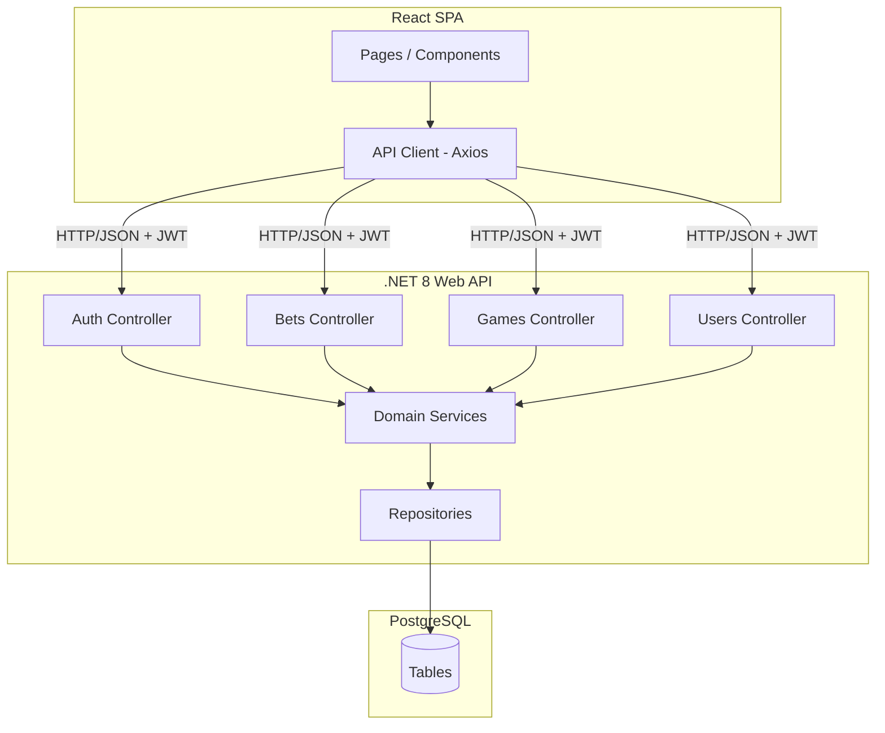
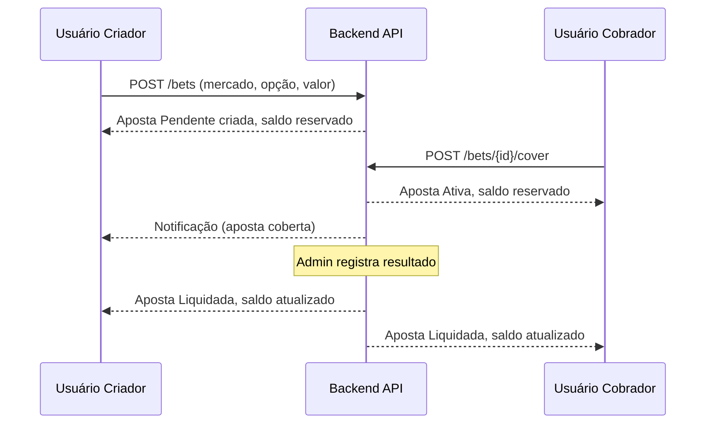

# Design Document — FrogBets

## Overview

FrogBets é uma plataforma web P2P de apostas virtuais para membros do FrogEventos apostarem em jogos de Counter-Strike. Toda aposta precisa ser coberta por outro usuário para ser válida; não há casa cobrindo apostas. O saldo é puramente fictício e serve como métrica de desempenho.

A stack é:
- **Backend**: .NET 8 Web API (REST + JWT)
- **Frontend**: React (SPA)
- **Banco de dados**: PostgreSQL

---

## Architecture



### Fluxo de autenticação

JWT Bearer tokens com expiração configurável. O frontend armazena o token em memória (não em localStorage) e o envia no header `Authorization: Bearer <token>`. Ao expirar, o usuário é redirecionado para login.

### Fluxo de aposta P2P



---

## Components and Interfaces

### Backend — Controllers

| Controller | Responsabilidade |
|---|---|
| `AuthController` | Login, logout, refresh |
| `UsersController` | Cadastro, perfil, saldo |
| `GamesController` | CRUD de jogos (admin), listagem pública |
| `BetsController` | Criar, cobrir, cancelar, listar apostas |
| `LeaderboardController` | Ranking de apostadores |

### Backend — Domain Services

| Service | Responsabilidade |
|---|---|
| `AuthService` | Geração/validação de JWT, hash de senha |
| `BalanceService` | Reserva, devolução e crédito de saldo virtual |
| `BetService` | Regras de negócio de apostas (criar, cobrir, cancelar) |
| `SettlementService` | Liquidação de apostas ao registrar resultado |
| `GameService` | Gerenciamento de jogos e mercados |

### Frontend — Pages

| Page | Rota |
|---|---|
| `LoginPage` | `/login` |
| `DashboardPage` | `/` |
| `GamesPage` | `/games` |
| `GameDetailPage` | `/games/:id` |
| `BetsPage` | `/bets` (apostas do usuário) |
| `MarketplacePage` | `/marketplace` (apostas pendentes públicas) |
| `LeaderboardPage` | `/leaderboard` |
| `AdminPage` | `/admin` |

### REST API — Endpoints principais

```
POST   /api/auth/login
POST   /api/auth/logout

GET    /api/users/me
GET    /api/users/me/balance

GET    /api/games
POST   /api/games                    (admin)
PATCH  /api/games/{id}/start         (admin)
POST   /api/games/{id}/results       (admin)

GET    /api/bets                     (apostas do usuário autenticado)
POST   /api/bets
POST   /api/bets/{id}/cover
DELETE /api/bets/{id}                (cancelar aposta pendente)

GET    /api/marketplace              (apostas pendentes públicas)

GET    /api/leaderboard
```

---

## Data Models

### User

```csharp
public class User
{
    public Guid Id { get; set; }
    public string Username { get; set; }
    public string PasswordHash { get; set; }
    public bool IsAdmin { get; set; }
    public decimal VirtualBalance { get; set; }      // saldo disponível
    public decimal ReservedBalance { get; set; }     // valor em apostas ativas/pendentes
    public DateTime CreatedAt { get; set; }
}
```

> Saldo inicial: 1000 unidades. `VirtualBalance + ReservedBalance` = saldo total do usuário.

### Game

```csharp
public class Game
{
    public Guid Id { get; set; }
    public string TeamA { get; set; }
    public string TeamB { get; set; }
    public DateTime ScheduledAt { get; set; }
    public int NumberOfMaps { get; set; }            // formato da série
    public GameStatus Status { get; set; }           // Scheduled | InProgress | Finished
    public DateTime CreatedAt { get; set; }
}

public enum GameStatus { Scheduled, InProgress, Finished }
```

### Market

```csharp
public class Market
{
    public Guid Id { get; set; }
    public Guid GameId { get; set; }
    public MarketType Type { get; set; }
    public int? MapNumber { get; set; }              // null = mercado de série
    public MarketStatus Status { get; set; }         // Open | Closed | Settled | Voided
    public string? WinningOption { get; set; }       // preenchido na liquidação
}

public enum MarketType
{
    MapWinner,          // vencedor do mapa
    SeriesWinner,       // vencedor da série
    TopKills,           // jogador com mais kills
    MostDeaths,         // jogador com mais mortes
    MostUtilityDamage   // jogador com maior dano por utilitários
}

public enum MarketStatus { Open, Closed, Settled, Voided }
```

### Bet

```csharp
public class Bet
{
    public Guid Id { get; set; }
    public Guid MarketId { get; set; }
    public Guid CreatorId { get; set; }
    public Guid? CoveredById { get; set; }
    public string CreatorOption { get; set; }        // opção escolhida pelo criador
    public string? CovererOption { get; set; }       // opção oposta, atribuída ao cobrir
    public decimal Amount { get; set; }              // valor apostado por cada lado
    public BetStatus Status { get; set; }
    public BetResult? Result { get; set; }           // null até liquidação
    public DateTime CreatedAt { get; set; }
    public DateTime? CoveredAt { get; set; }
    public DateTime? SettledAt { get; set; }
}

public enum BetStatus { Pending, Active, Settled, Cancelled, Voided }
public enum BetResult { CreatorWon, CovererWon, Voided }
```

### GameResult

```csharp
public class GameResult
{
    public Guid Id { get; set; }
    public Guid GameId { get; set; }
    public Guid MarketId { get; set; }
    public string WinningOption { get; set; }
    public int? MapNumber { get; set; }
    public DateTime RegisteredAt { get; set; }
    public Guid RegisteredByAdminId { get; set; }
}
```

### Notification

```csharp
public class Notification
{
    public Guid Id { get; set; }
    public Guid UserId { get; set; }
    public string Message { get; set; }
    public bool IsRead { get; set; }
    public DateTime CreatedAt { get; set; }
}
```

---


## Correctness Properties

*A property is a characteristic or behavior that should hold true across all valid executions of a system — essentially, a formal statement about what the system should do. Properties serve as the bridge between human-readable specifications and machine-verifiable correctness guarantees.*

**Property Reflection:** Após análise do prework, as seguintes consolidações foram feitas:
- 2.3 e 2.5 (reserva de saldo ao criar e ao cobrir) são instâncias do mesmo invariante de saldo → combinados em Property 2.
- 2.7 e 2.8 (rejeição por saldo insuficiente ao criar e ao cobrir) → combinados em Property 3.
- 2.6 e 7.2 (crédito ao vencedor) → mesma propriedade, mantida como Property 4.
- 3.3 e 4.4 (rejeição de aposta em jogo iniciado) → mesma propriedade, mantida como Property 5.
- 3.5 e 7.1 (liquidação completa de todas as apostas) → mesma propriedade, mantida como Property 6.
- 2.4 e 6.2 (devolução de saldo ao cancelar) → mesma propriedade, mantida como Property 7.
- 5.4 e 3.6 (idempotência de cobertura e resultado) → mantidas separadas pois cobrem entidades distintas.

---

### Property 1: Credenciais inválidas não revelam qual campo está errado

*Para qualquer* combinação de username e password inválidos, a mensagem de erro retornada pelo sistema não deve indicar qual dos dois campos está incorreto.

**Validates: Requirements 1.3**

---

### Property 2: Invariante de saldo ao reservar

*Para qualquer* usuário com saldo disponível suficiente e qualquer valor válido de aposta, após criar ou cobrir uma aposta com esse valor: o `ReservedBalance` aumenta exatamente pelo valor da aposta, o `VirtualBalance` diminui exatamente pelo mesmo valor, e a soma `VirtualBalance + ReservedBalance` permanece inalterada.

**Validates: Requirements 2.3, 2.5**

---

### Property 3: Rejeição por saldo insuficiente

*Para qualquer* usuário com saldo disponível B e qualquer valor V > B, tanto a criação quanto a cobertura de uma aposta com valor V devem ser rejeitadas, e o saldo do usuário deve permanecer inalterado.

**Validates: Requirements 2.7, 2.8**

---

### Property 4: Crédito correto ao vencedor na liquidação

*Para qualquer* aposta ativa com valor A apostado por cada lado, quando liquidada com um vencedor, o `VirtualBalance` do vencedor deve aumentar em 2*A (valor próprio + valor da contraparte) e o `ReservedBalance` do vencedor deve diminuir em A.

**Validates: Requirements 2.6, 7.2**

---

### Property 5: Apostas bloqueadas para jogos iniciados

*Para qualquer* jogo com status `InProgress` ou `Finished`, qualquer tentativa de criar uma aposta nesse jogo deve ser rejeitada.

**Validates: Requirements 3.3, 4.4**

---

### Property 6: Liquidação completa de todas as apostas ativas

*Para qualquer* mercado com N apostas ativas, após o administrador registrar o resultado desse mercado, todas as N apostas devem ter status `Settled` ou `Voided` — nenhuma deve permanecer `Active`.

**Validates: Requirements 3.5, 7.1**

---

### Property 7: Round-trip de cancelamento restaura saldo

*Para qualquer* usuário e qualquer valor válido de aposta, criar uma aposta pendente e em seguida cancelá-la deve restaurar o `VirtualBalance` e o `ReservedBalance` exatamente aos valores anteriores à criação.

**Validates: Requirements 2.4, 6.2**

---

### Property 8: Unicidade de aposta por usuário e mercado

*Para qualquer* usuário e qualquer mercado, se o usuário já possui uma aposta ativa (Pending ou Active) naquele mercado, qualquer tentativa de criar uma segunda aposta no mesmo mercado deve ser rejeitada.

**Validates: Requirements 4.6**

---

### Property 9: Cobertura registra contraparte e opção oposta corretamente

*Para qualquer* aposta pendente com `creatorOption` X e qualquer usuário elegível que a cubra, após a cobertura: `CoveredById` deve ser o id do cobrador, `CovererOption` deve ser a opção oposta a X para aquele tipo de mercado, e o status deve ser `Active`.

**Validates: Requirements 5.2, 5.5**

---

### Property 10: Criador não pode cobrir a própria aposta

*Para qualquer* aposta, uma tentativa de cobertura feita pelo próprio criador da aposta deve ser rejeitada.

**Validates: Requirements 5.3**

---

### Property 11: Aposta já coberta não pode ser coberta novamente

*Para qualquer* aposta com status `Active`, qualquer tentativa de cobertura adicional deve ser rejeitada.

**Validates: Requirements 5.4**

---

### Property 12: Notificação ao criador quando aposta é coberta

*Para qualquer* aposta pendente que seja coberta, deve existir ao menos uma notificação não lida para o usuário criador informando que a aposta foi coberta.

**Validates: Requirements 5.6**

---

### Property 13: Apenas o criador pode cancelar a própria aposta

*Para qualquer* aposta pendente, uma tentativa de cancelamento feita por um usuário diferente do criador deve ser rejeitada.

**Validates: Requirements 6.4**

---

### Property 14: Aposta ativa não pode ser cancelada

*Para qualquer* aposta com status `Active`, qualquer tentativa de cancelamento deve ser rejeitada.

**Validates: Requirements 6.3**

---

### Property 15: Aposta anulada devolve saldo a ambos os lados

*Para qualquer* aposta ativa que seja anulada (resultado empate em mercado que não admite empate), o `VirtualBalance` do criador e do cobrador devem ser restaurados ao valor anterior à reserva, e o status da aposta deve ser `Voided`.

**Validates: Requirements 7.5**

---

### Property 16: Resultado de jogo já liquidado é rejeitado

*Para qualquer* jogo com status `Finished`, qualquer tentativa de registrar um novo resultado deve ser rejeitada.

**Validates: Requirements 3.6**

---

### Property 17: Resposta da API de apostas contém todos os campos obrigatórios

*Para qualquer* aposta retornada pela API, a resposta deve conter: mercado, opção do criador, valor, status, e — quando existir — o id da contraparte e a opção da contraparte.

**Validates: Requirements 8.2**

---

### Property 18: Histórico de apostas liquidadas ordenado por data decrescente

*Para qualquer* conjunto de apostas liquidadas de um usuário, o endpoint de histórico deve retorná-las ordenadas por `SettledAt` em ordem decrescente (mais recente primeiro).

**Validates: Requirements 8.3**

---

### Property 19: Leaderboard ordenado por saldo decrescente com campos obrigatórios

*Para qualquer* conjunto de usuários com saldos distintos, o leaderboard deve retorná-los ordenados por `VirtualBalance` decrescente, e cada entrada deve conter `username`, `virtualBalance`, `winsCount` e `lossesCount`.

**Validates: Requirements 9.1, 9.3**

---

## Error Handling

### Erros de autenticação
- `401 Unauthorized` — token ausente, inválido ou expirado
- `403 Forbidden` — usuário autenticado sem permissão (ex: não-admin tentando acessar endpoint admin)
- Mensagens de erro de login são genéricas: `"Credenciais inválidas"` (não revela qual campo)

### Erros de negócio (apostas)
- `400 Bad Request` com código de erro estruturado para:
  - Saldo insuficiente (`INSUFFICIENT_BALANCE`)
  - Jogo já iniciado (`GAME_ALREADY_STARTED`)
  - Aposta duplicada no mesmo mercado (`DUPLICATE_BET_ON_MARKET`)
  - Tentativa de cobrir a própria aposta (`CANNOT_COVER_OWN_BET`)
  - Aposta não mais disponível para cobertura (`BET_NOT_AVAILABLE`)
  - Cancelamento de aposta ativa (`CANNOT_CANCEL_ACTIVE_BET`)
  - Cancelamento de aposta de outro usuário (`NOT_BET_OWNER`)
- `409 Conflict` para operações de estado inválido (ex: registrar resultado em jogo já liquidado)

### Formato de erro padrão

```json
{
  "error": {
    "code": "INSUFFICIENT_BALANCE",
    "message": "Saldo Virtual insuficiente para realizar esta aposta."
  }
}
```

### Concorrência
- Reserva e crédito de saldo usam transações de banco de dados com isolamento `Serializable` para evitar race conditions (dois usuários cobrindo a mesma aposta simultaneamente).
- A cobertura de aposta usa `SELECT FOR UPDATE` na linha da aposta para garantir exclusividade.

---

## Testing Strategy

### Abordagem dual

A estratégia combina testes de exemplo (unit/integration) para comportamentos específicos e testes baseados em propriedades (PBT) para invariantes universais.

### Property-Based Testing

A biblioteca escolhida é **FsCheck** (integrada com xUnit para .NET). Cada propriedade do design deve ser implementada como um teste FsCheck com mínimo de 100 iterações.

Tag format para cada teste de propriedade:
```
// Feature: frog-bets, Property {N}: {property_text}
```

Propriedades implementadas como PBT (ver seção Correctness Properties):
- Property 1 — credenciais inválidas não revelam campo
- Property 2 — invariante de saldo ao reservar
- Property 3 — rejeição por saldo insuficiente
- Property 4 — crédito correto ao vencedor
- Property 5 — apostas bloqueadas para jogos iniciados
- Property 6 — liquidação completa de todas as apostas ativas
- Property 7 — round-trip de cancelamento restaura saldo
- Property 8 — unicidade de aposta por usuário e mercado
- Property 9 — cobertura registra contraparte e opção oposta
- Property 10 — criador não pode cobrir a própria aposta
- Property 11 — aposta já coberta não pode ser coberta novamente
- Property 12 — notificação ao criador quando aposta é coberta
- Property 13 — apenas o criador pode cancelar
- Property 14 — aposta ativa não pode ser cancelada
- Property 15 — aposta anulada devolve saldo a ambos
- Property 16 — resultado de jogo liquidado é rejeitado
- Property 17 — resposta da API contém campos obrigatórios
- Property 18 — histórico ordenado por data decrescente
- Property 19 — leaderboard ordenado por saldo com campos obrigatórios

### Testes de exemplo (xUnit)

Focados em:
- Fluxo completo de login com credenciais válidas
- Criação de jogo pelo admin e listagem pública
- Fluxo end-to-end: criar aposta → cobrir → registrar resultado → verificar saldos
- Exibição de saldo disponível e reservado
- Listagem de apostas pendentes no marketplace
- Histórico de apostas liquidadas

### Testes de integração

- Endpoints protegidos retornam 401 sem token
- Endpoints admin retornam 403 para usuários comuns
- Concorrência: dois usuários tentando cobrir a mesma aposta simultaneamente — apenas um deve ter sucesso

### Frontend (React)

- Testes de componente com **React Testing Library** + **Vitest**
- Foco em: formulário de login, listagem de apostas, fluxo de cobertura, exibição de saldo e leaderboard
- Mocks de API com **MSW (Mock Service Worker)**
