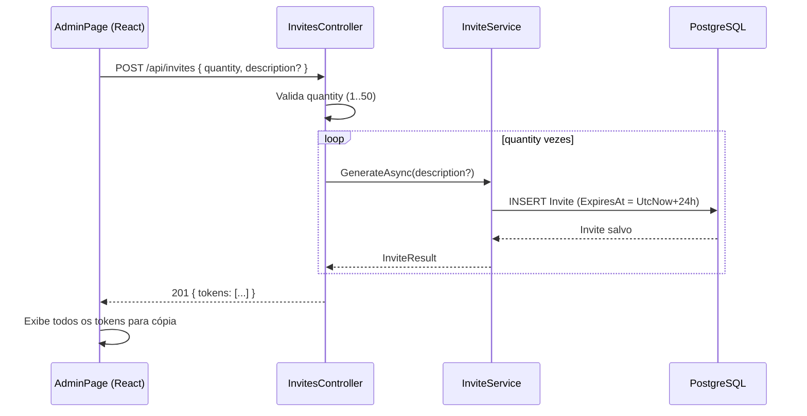

# Design Document — invite-improvements

## Overview

Esta feature implementa duas melhorias no sistema de convites do painel admin:

1. **Validade fixa de 24h**: o campo `ExpiresAt` deixa de ser parâmetro externo. O `InviteService` calcula `DateTime.UtcNow + 24h` internamente. O formulário do `AdminPage` remove o campo "Expira em".

2. **Geração em massa**: o admin pode gerar 1 a 50 convites em uma única requisição. O campo "Destinatário" só aparece quando `quantity = 1`. Todos os tokens gerados são exibidos para cópia.

A lógica de revogação, validação e marcação de uso permanece inalterada.

---

## Architecture



A geração em lote é feita no controller (loop sobre `GenerateAsync`), mantendo o serviço com responsabilidade única. Não há transação distribuída necessária — cada convite é independente.

---

## Components and Interfaces

### Backend

#### `IInviteService` — alterações

O método `GenerateAsync` perde o parâmetro `expiresAt`:

```csharp
// Antes
Task<InviteResult> GenerateAsync(DateTime expiresAt, string? description);

// Depois
Task<InviteResult> GenerateAsync(string? description);
```

Os demais métodos (`GetAllAsync`, `RevokeAsync`, `ValidateAsync`, `MarkUsedAsync`) não mudam.

#### `InviteService` — alterações

```csharp
public async Task<InviteResult> GenerateAsync(string? description)
{
    var invite = new Invite
    {
        Id          = Guid.NewGuid(),
        Token       = Convert.ToHexString(RandomNumberGenerator.GetBytes(16)).ToLower(),
        Description = description,
        ExpiresAt   = DateTime.UtcNow.AddHours(24),   // fixo, sem parâmetro externo
        CreatedAt   = DateTime.UtcNow,
    };
    _db.Invites.Add(invite);
    await _db.SaveChangesAsync();
    return ToResult(invite);
}
```

#### `InvitesController` — alterações

Novo record de request e resposta:

```csharp
// Substitui CreateInviteRequest
public record CreateInvitesRequest(
    [Range(1, 50)] int Quantity = 1,
    string? Description = null
);

// Nova resposta para geração em lote
public record CreateInvitesResponse(IReadOnlyList<string> Tokens);
```

Novo handler do `POST /api/invites`:

```csharp
[HttpPost]
public async Task<IActionResult> CreateInvites([FromBody] CreateInvitesRequest request)
{
    if (!await IsAdminFromDb()) return Forbid();

    if (request.Quantity < 1 || request.Quantity != Math.Floor((double)request.Quantity))
        return BadRequest(new { error = new { code = "INVALID_QUANTITY",
            message = "A quantidade deve ser um número inteiro maior que 0." } });

    if (request.Quantity > 50)
        return BadRequest(new { error = new { code = "QUANTITY_LIMIT_EXCEEDED",
            message = "A quantidade máxima por requisição é 50." } });

    var description = request.Quantity == 1 ? request.Description : null;
    var tokens = new List<string>(request.Quantity);

    for (int i = 0; i < request.Quantity; i++)
    {
        var result = await _inviteService.GenerateAsync(description);
        tokens.Add(result.Token);
    }

    return StatusCode(201, new CreateInvitesResponse(tokens));
}
```

> A validação de `Quantity` via `[Range(1, 50)]` no record serve como primeira barreira (model binding). O check explícito no handler garante os códigos de erro padronizados.

### Frontend

#### `InvitesSection` — alterações

Estado adicionado:
- `quantity: number` (padrão `1`)
- `newTokens: string[]` (substitui `newToken: string | null`)

Campos removidos do formulário:
- `inviteExpiresAt` (datetime-local)

Campos adicionados:
- `inviteQuantity` (number, min=1, max=50, padrão=1)

Campo condicional:
- `inviteDescription` visível apenas quando `quantity === 1`

Exibição pós-geração:
- Lista de todos os tokens com botão de cópia individual por token

Payload enviado:
```typescript
await apiClient.post<{ tokens: string[] }>('/invites', {
  quantity,
  description: quantity === 1 ? (description || null) : undefined,
})
```

---

## Data Models

Nenhuma alteração no schema do banco. A entidade `Invite` já possui o campo `ExpiresAt` — apenas a origem do valor muda (de parâmetro externo para cálculo interno).

```csharp
// Invite — sem alterações estruturais
Id, Token, Description, ExpiresAt, CreatedAt, UsedAt, UsedByUserId
```

A coluna "Expira em" continua sendo exibida na listagem do `AdminPage`, pois o valor continua sendo retornado pelo backend.

---

## Correctness Properties

*A property is a characteristic or behavior that should hold true across all valid executions of a system — essentially, a formal statement about what the system should do. Properties serve as the bridge between human-readable specifications and machine-verifiable correctness guarantees.*

### Property 1: Round-trip de geração com validade fixa

*For any* chamada a `GenerateAsync`, o convite gerado deve ter `ExpiresAt` dentro de uma janela de tolerância de ±5 segundos em relação a `DateTime.UtcNow.AddHours(24)`, e o token gerado deve ser validável via `ValidateAsync` imediatamente após a criação.

**Validates: Requirements 1.1, 3.1**

### Property 2: Geração em lote produz exatamente N tokens únicos

*For any* quantidade N no intervalo [1, 50], chamar `GenerateAsync` N vezes deve produzir exatamente N tokens, todos distintos entre si (sem colisão), cada um com 32 caracteres hexadecimais.

**Validates: Requirements 2.1, 2.2**

### Property 3: Quantidade inválida é rejeitada com código correto

*For any* quantidade menor que 1 ou maior que 50, o controller deve retornar HTTP 400 com o código de erro correspondente (`INVALID_QUANTITY` para < 1, `QUANTITY_LIMIT_EXCEEDED` para > 50), sem criar nenhum convite no banco.

**Validates: Requirements 2.6, 2.7**

### Property 4: Formulário oculta "Destinatário" quando quantity > 1

*For any* valor de `quantity` maior que 1, o componente `InvitesSection` não deve renderizar o campo "Destinatário" no DOM.

**Validates: Requirements 2.4**

### Property 5: Todos os tokens gerados são exibidos na UI

*For any* lista de N tokens retornada pela API após geração bem-sucedida, todos os N tokens devem estar presentes no DOM do componente `InvitesSection`.

**Validates: Requirements 2.5**

---

## Error Handling

| Situação | Código HTTP | Código de erro | Mensagem |
|---|---|---|---|
| `quantity < 1` ou não-inteiro | 400 | `INVALID_QUANTITY` | "A quantidade deve ser um número inteiro maior que 0." |
| `quantity > 50` | 400 | `QUANTITY_LIMIT_EXCEEDED` | "A quantidade máxima por requisição é 50." |
| Usuário não é admin | 403 | — | (Forbid padrão) |
| Convite não encontrado (revogação) | 404 | `INVITE_NOT_FOUND` | "Convite não encontrado." |
| Convite já usado (revogação) | 400 | `INVITE_ALREADY_USED` | "O convite já foi utilizado." |
| Convite já expirado (revogação) | 400 | `INVITE_ALREADY_EXPIRED` | "O convite já está expirado." |
| Token inválido (registro) | 400 | `INVALID_INVITE` | (existente) |
| Token expirado (registro) | 400 | `INVITE_EXPIRED` | (existente) |

Erros de geração parcial em lote: como cada `GenerateAsync` é independente, falhas de banco em iterações intermediárias resultam em 500 genérico. Não há rollback parcial — convites já inseridos permanecem. Na prática, falhas de banco são raras e o admin pode revogar tokens indesejados.

---

## Testing Strategy

### Testes unitários (xUnit — `InviteServiceTests.cs`)

Cobrem comportamentos específicos e casos de borda:
- `GenerateAsync` sem parâmetro `expiresAt` define `ExpiresAt ≈ UtcNow+24h`
- `GenerateAsync` com `description` preserva a descrição
- `GenerateAsync` com `quantity > 1` ignora `description` (responsabilidade do controller, mas verificável via integração)
- Comportamentos existentes de `ValidateAsync`, `RevokeAsync`, `MarkUsedAsync` continuam passando sem alteração

### Testes de propriedade (FsCheck — `InvitePropertyTests.cs`)

Biblioteca: **FsCheck** (já utilizada no projeto, via `FsCheck.Xunit`).
Cada teste roda com `MaxTest = 100`.

```csharp
// Feature: invite-improvements, Property 1: round-trip de geração com validade fixa
[Property(MaxTest = 100)]
public Property GenerateAsync_ExpiresAtIsFixedAt24h_AndTokenIsValidatable() { ... }

// Feature: invite-improvements, Property 2: geração em lote produz exatamente N tokens únicos
[Property(MaxTest = 100)]
public Property BatchGenerate_ProducesExactlyNUniqueTokens() { ... }

// Feature: invite-improvements, Property 3: quantidade inválida é rejeitada com código correto
[Property(MaxTest = 100)]
public Property InvalidQuantity_IsRejectedWithCorrectCode() { ... }
```

As Properties 4 e 5 (UI) são testadas com **Vitest + React Testing Library** no frontend:

```typescript
// Feature: invite-improvements, Property 4: formulário oculta Destinatário quando quantity > 1
// Feature: invite-improvements, Property 5: todos os tokens gerados são exibidos na UI
```

### Testes de integração

Os testes existentes em `InviteServiceTests.cs` continuam válidos após a remoção do parâmetro `expiresAt` — apenas a assinatura do método muda, os comportamentos de validação e revogação são preservados.

### Documentação a atualizar

- `docs/TECHNICAL.md`: atualizar assinatura do endpoint `POST /api/invites` e resposta
- `docs/domain-model.md` (steering): nenhuma alteração estrutural na entidade `Invite`
