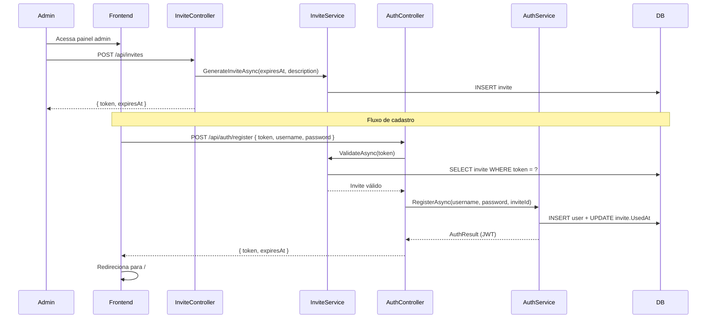

# Design Document — Invite System

## Overview

O sistema de convites adiciona um mecanismo de acesso controlado ao FrogBets. Atualmente a plataforma não possui tela de cadastro; qualquer novo usuário fica preso na tela de login. A solução introduz:

- Uma entidade `Invite` no domínio, representando um token de uso único com validade configurável.
- Endpoints REST protegidos por role de Administrador para geração, listagem e revogação de convites.
- Um endpoint público de cadastro que valida o token antes de criar a conta.
- Uma tela de cadastro no frontend acessível a partir do link "Criar conta" na tela de login.

O fluxo é simples: o Admin gera um convite → compartilha o token com o convidado → o convidado acessa `/register`, preenche o formulário e cria sua conta → o token é marcado como utilizado.

---

## Architecture



### Decisões de design

- **Token gerado no backend**: `Guid.NewGuid()` convertido para string sem hífens (32 chars hex) é suficientemente aleatório e simples de copiar/colar. Alternativa seria `RandomNumberGenerator` para maior entropia — optamos por GUID por consistência com o restante do domínio.
- **Status derivado, não armazenado**: O status do convite (pendente / utilizado / expirado) é calculado em runtime a partir de `UsedAt` e `ExpiresAt`, evitando inconsistências de estado.
- **Revogação via `ExpiresAt`**: Revogar um convite significa setar `ExpiresAt = UtcNow`, tornando-o imediatamente expirado. Isso reutiliza a lógica de validação existente sem campo extra.
- **Registro no `AuthController`**: O endpoint `POST /api/auth/register` fica no `AuthController` por coesão — é uma operação de autenticação/identidade. A lógica de convite fica no `InviteService`.
- **Saldo inicial via constante**: O saldo inicial de 1000 unidades é definido como constante no `AuthService` para facilitar mudança futura.

---

## Components and Interfaces

### Backend

#### `Invite` (Domain Entity)
Nova entidade em `FrogBets.Domain/Entities/Invite.cs`.

#### `InviteStatus` (Enum)
Enum calculado em `FrogBets.Domain/Enums/InviteStatus.cs` — usado apenas para serialização de resposta.

#### `IInviteService` / `InviteService`
Serviço em `FrogBets.Api/Services/` responsável por:
- `GenerateAsync(expiresAt, description?)` → cria e persiste o convite
- `GetAllAsync()` → lista todos os convites com status calculado
- `RevokeAsync(id)` → revoga convite pendente
- `ValidateAndConsumeAsync(token)` → valida e retorna o `Invite` (sem marcar como usado ainda)
- `MarkUsedAsync(inviteId)` → marca como usado (chamado após criação do usuário)

#### `InvitesController`
`FrogBets.Api/Controllers/InvitesController.cs` — todos os endpoints requerem `[Authorize]` + verificação de `isAdmin`.

| Método | Rota | Descrição |
|--------|------|-----------|
| POST | `/api/invites` | Gera novo convite |
| GET | `/api/invites` | Lista todos os convites |
| DELETE | `/api/invites/{id}` | Revoga convite pendente |

#### `AuthController` — novo endpoint
`POST /api/auth/register` — público (`[AllowAnonymous]`), valida token e cria usuário.

#### `IAuthService` — novo método
`RegisterAsync(username, password, inviteId)` → cria usuário com saldo inicial e retorna `AuthResult`.

### Frontend

#### `RegisterPage.tsx`
Nova página em `frontend/src/pages/RegisterPage.tsx` com formulário: token de convite, nome de usuário, senha.

#### Rota `/register`
Adicionada em `App.tsx` como rota pública (fora do `ProtectedRoute`).

#### `LoginPage.tsx` — link "Criar conta"
Link `<Link to="/register">` adicionado abaixo do botão de login.

---

## Data Models

### Entidade `Invite`

```csharp
public class Invite
{
    public Guid Id { get; set; }
    public string Token { get; set; } = string.Empty;   // 32-char hex, único
    public string? Description { get; set; }             // destinatário pretendido (opcional)
    public DateTime ExpiresAt { get; set; }
    public DateTime CreatedAt { get; set; }
    public DateTime? UsedAt { get; set; }                // null = não utilizado
    public Guid? UsedByUserId { get; set; }

    // Navigation
    public User? UsedByUser { get; set; }
}
```

### Status calculado

```csharp
public enum InviteStatus { Pending, Used, Expired }

// Lógica de cálculo:
// UsedAt != null          → Used
// ExpiresAt <= UtcNow     → Expired
// else                    → Pending
```

### Migration (EF Core)

Nova migration `AddInvites` cria a tabela `Invites`:

```sql
CREATE TABLE "Invites" (
    "Id"            uuid            NOT NULL,
    "Token"         varchar(32)     NOT NULL,
    "Description"   varchar(200),
    "ExpiresAt"     timestamptz     NOT NULL,
    "CreatedAt"     timestamptz     NOT NULL,
    "UsedAt"        timestamptz,
    "UsedByUserId"  uuid            REFERENCES "Users"("Id"),
    CONSTRAINT "PK_Invites" PRIMARY KEY ("Id")
);
CREATE UNIQUE INDEX "IX_Invites_Token" ON "Invites"("Token");
```

### DTOs

```csharp
// Request — geração
record CreateInviteRequest(DateTime ExpiresAt, string? Description);

// Response — convite
record InviteResponse(
    Guid Id,
    string Token,
    string? Description,
    DateTime ExpiresAt,
    DateTime CreatedAt,
    string Status   // "Pending" | "Used" | "Expired"
);

// Request — cadastro
record RegisterRequest(string InviteToken, string Username, string Password);
```

---

## Correctness Properties

*A property is a characteristic or behavior that should hold true across all valid executions of a system — essentially, a formal statement about what the system should do. Properties serve as the bridge between human-readable specifications and machine-verifiable correctness guarantees.*

### Property 1: Token de convite é de uso único

*Para qualquer* token de convite válido, após ser utilizado com sucesso para criar uma conta, qualquer tentativa subsequente de cadastro com o mesmo token deve ser rejeitada.

**Validates: Requirements 1.3, 3.4**

### Property 2: Validação de token rejeita inválidos

*Para qualquer* string que não corresponda a um token existente, não utilizado e não expirado, o endpoint de cadastro deve rejeitar a operação sem criar usuário.

**Validates: Requirements 2.1, 2.2, 2.3, 2.4**

### Property 3: Falha no cadastro preserva o token

*Para qualquer* tentativa de cadastro que falhe (username duplicado, senha inválida, etc.), o token de convite deve permanecer com status `Pending` após a falha.

**Validates: Requirements 3.8**

### Property 4: Revogação torna token inválido

*Para qualquer* convite com status `Pending`, após ser revogado, qualquer tentativa de cadastro com seu token deve ser rejeitada.

**Validates: Requirements 4.1, 4.2**

### Property 5: Status calculado é consistente

*Para qualquer* convite, o status retornado pela API deve ser determinístico: `Used` se `UsedAt != null`, `Expired` se `ExpiresAt <= UtcNow`, `Pending` caso contrário — e essas condições são mutuamente exclusivas.

**Validates: Requirements 1.4**

---

## Error Handling

| Cenário | HTTP Status | Código de erro |
|---------|-------------|----------------|
| Token não encontrado | 400 | `INVALID_INVITE` |
| Token já utilizado | 400 | `INVITE_ALREADY_USED` |
| Token expirado | 400 | `INVITE_EXPIRED` |
| Username já em uso | 409 | `USERNAME_TAKEN` |
| Senha < 8 caracteres | 400 | `PASSWORD_TOO_SHORT` |
| Revogar convite já usado | 400 | `INVITE_ALREADY_USED` |
| Revogar convite já expirado | 400 | `INVITE_ALREADY_EXPIRED` |
| Endpoint admin sem permissão | 403 | (padrão ASP.NET) |

**Nota de segurança**: O critério 2.2 exige que token inexistente retorne mensagem genérica (`INVALID_INVITE`) — igual ao token expirado — para não revelar se o token existe. Token já utilizado pode ter mensagem específica pois não revela informação sensível.

---

## Testing Strategy

### Abordagem dual

- **Testes unitários**: cobrem exemplos concretos, casos de borda e condições de erro.
- **Testes de propriedade**: verificam propriedades universais usando [FsCheck](https://fscheck.github.io/FsCheck/) (.NET) e [fast-check](https://fast-check.io/) (TypeScript/frontend).

### Testes unitários (backend — xUnit)

- `InviteService`: geração de token único, validação de token válido/inválido/expirado/usado, revogação, preservação de token em falha de cadastro.
- `AuthService.RegisterAsync`: criação de usuário com saldo 1000, hash de senha, retorno de JWT.
- `InvitesController`: autorização admin, respostas HTTP corretas.
- `AuthController.Register`: fluxo completo com mock de `IInviteService` e `IAuthService`.

### Testes de propriedade (FsCheck — mínimo 100 iterações cada)

Cada teste referencia a propriedade do design com o tag:
`// Feature: invite-system, Property {N}: {texto}`

- **Property 1** — Gerar token aleatório, usar para cadastro, tentar usar novamente → segunda tentativa sempre rejeitada.
- **Property 2** — Gerar strings aleatórias como token → endpoint sempre rejeita sem criar usuário.
- **Property 3** — Gerar dados de cadastro inválidos (username duplicado, senha curta) com token válido → token permanece `Pending`.
- **Property 4** — Gerar convite pendente, revogar, tentar cadastro → sempre rejeitado.
- **Property 5** — Gerar convites com combinações aleatórias de `UsedAt`/`ExpiresAt` → status calculado é sempre um dos três valores e mutuamente exclusivo.

### Testes de integração

- Fluxo completo: gerar convite → cadastrar usuário → verificar JWT válido + saldo 1000.
- Fluxo de revogação: gerar convite → revogar → tentar cadastro → 400.
- Autorização: endpoints admin sem token → 401; com token de não-admin → 403.

### Testes frontend (Vitest + Testing Library)

- `RegisterPage`: renderização do formulário, submissão com sucesso (mock API), exibição de erros.
- `LoginPage`: presença do link "Criar conta" apontando para `/register`.
