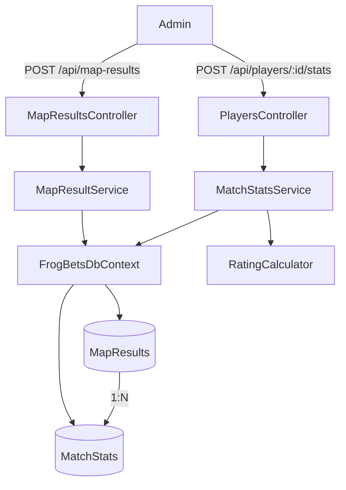

# Design Document — match-stats-per-map

## Overview

A feature introduz a entidade `MapResult`, que representa um mapa específico dentro de uma série (`Game`). Atualmente, `MatchStats` carrega `Rounds` diretamente, tornando o campo redundante para os 10 jogadores de um mesmo mapa. Com `MapResult`, os `Rounds` passam a viver em um único lugar por mapa, e `MatchStats` passa a referenciar `MapResultId` em vez de `GameId` + `Rounds`.

O fluxo de inserção pelo admin muda de:
> Seleciona Game → Seleciona Jogador → Informa kills/deaths/assists/damage/rounds/KAST%

Para:
> Seleciona Game → Seleciona MapResult (mapa da série, já com Rounds) → Seleciona Jogador → Informa kills/deaths/assists/damage/KAST%

O rating continua sendo calculado pela mesma fórmula HLTV 2.0 adaptada, usando os `Rounds` do `MapResult` referenciado.

## Architecture

O sistema segue a arquitetura em camadas já estabelecida no projeto:

```
Domain        → MapResult (nova entidade), MatchStats (refatorada)
Infrastructure → FrogBetsDbContext (novo DbSet + configuração EF), Migrations
Api/Services  → IMapResultService + MapResultService (novo), IMatchStatsService + MatchStatsService (refatorado)
Api/Controllers → PlayersController (refatorado), novo MapResultsController
Frontend      → players.ts (novos tipos/funções), AdminPage.tsx (MatchStatsSection refatorada)
```



## Components and Interfaces

### Backend — novo serviço MapResult

```csharp
// IMapResultService.cs
public record CreateMapResultRequest(Guid GameId, int MapNumber, int Rounds);

public record MapResultDto(Guid Id, Guid GameId, int MapNumber, int Rounds, DateTime CreatedAt);

public interface IMapResultService
{
    Task<MapResultDto> CreateMapResultAsync(CreateMapResultRequest request);
    Task<IReadOnlyList<MapResultDto>> GetByGameAsync(Guid gameId);
}
```

### Backend — IMatchStatsService refatorado

```csharp
// IMatchStatsService.cs
public record RegisterStatsRequest(
    Guid PlayerId, Guid MapResultId,
    int Kills, int Deaths, int Assists,
    double TotalDamage, double KastPercent);

public record MatchStatsDto(
    Guid Id, Guid PlayerId, Guid MapResultId,
    int MapNumber, int Rounds,
    int Kills, int Deaths, int Assists,
    double TotalDamage, double KastPercent, double Rating, DateTime CreatedAt);

public interface IMatchStatsService
{
    Task<MatchStatsDto> RegisterStatsAsync(RegisterStatsRequest request);
    Task<IReadOnlyList<MatchStatsDto>> GetStatsByPlayerAsync(Guid playerId);
}
```

### Backend — MapResultsController (novo)

```
POST /api/map-results          → cria MapResult (admin)
GET  /api/map-results?gameId=  → lista MapResults de um Game (admin, para popular dropdown)
```

### Backend — PlayersController (refatorado)

```
POST /api/players/{id}/stats   → RegisterStatsRequest agora usa MapResultId (sem Rounds)
GET  /api/players/{id}/stats   → retorna MatchStatsDto[] agrupados por mapa
```

### Frontend — players.ts

Novos tipos e funções:
- `MapResult { id, gameId, mapNumber, rounds, createdAt }`
- `createMapResult(data)` → `POST /api/map-results`
- `getMapResultsByGame(gameId)` → `GET /api/map-results?gameId=`
- `RegisterStatsPayload` atualizado: remove `rounds`, adiciona `mapResultId`
- `MatchStatsDto` atualizado: inclui `mapResultId`, `mapNumber`, `rounds`

### Frontend — AdminPage.tsx

`MatchStatsSection` passa a ter três etapas sequenciais:
1. Seleciona Game (InProgress ou Finished)
2. Seleciona MapResult do Game escolhido (carregado via `getMapResultsByGame`)
3. Seleciona Jogador e informa kills/deaths/assists/damage/KAST%

Adicionada sub-seção "Registrar Mapa" antes de "Estatísticas de Partida" para criar MapResults.

## Data Models

### Nova entidade `MapResult`

```csharp
public class MapResult
{
    public Guid Id { get; set; }
    public Guid GameId { get; set; }
    public int MapNumber { get; set; }      // >= 1
    public int Rounds { get; set; }         // > 0
    public DateTime CreatedAt { get; set; }

    // Navigation
    public Game Game { get; set; } = null!;
    public ICollection<MatchStats> Stats { get; set; } = new List<MatchStats>();
}
```

Constraint de unicidade: `(GameId, MapNumber)`.

### `MatchStats` refatorada

```csharp
public class MatchStats
{
    public Guid Id { get; set; }
    public Guid PlayerId { get; set; }
    public Guid MapResultId { get; set; }   // substitui GameId
    // Rounds removido — obtido via MapResult
    public int Kills { get; set; }
    public int Deaths { get; set; }
    public int Assists { get; set; }
    public double TotalDamage { get; set; }
    public double KastPercent { get; set; }
    public double Rating { get; set; }
    public DateTime CreatedAt { get; set; }

    // Navigation
    public CS2Player Player { get; set; } = null!;
    public MapResult MapResult { get; set; } = null!;
}
```

Constraint de unicidade muda de `(PlayerId, GameId)` para `(PlayerId, MapResultId)`.

### Configuração EF Core (OnModelCreating)

```csharp
// MapResult
modelBuilder.Entity<MapResult>(e =>
{
    e.HasKey(m => m.Id);
    e.HasIndex(m => new { m.GameId, m.MapNumber }).IsUnique();
    e.Property(m => m.CreatedAt).IsRequired();
    e.HasOne(m => m.Game)
        .WithMany()
        .HasForeignKey(m => m.GameId)
        .OnDelete(DeleteBehavior.Restrict);
    e.HasMany(m => m.Stats)
        .WithOne(s => s.MapResult)
        .HasForeignKey(s => s.MapResultId)
        .OnDelete(DeleteBehavior.Restrict);
});

// MatchStats — substituir configuração existente
modelBuilder.Entity<MatchStats>(e =>
{
    e.HasKey(s => s.Id);
    e.HasIndex(s => new { s.PlayerId, s.MapResultId }).IsUnique();
    e.Property(s => s.CreatedAt).IsRequired();
    // FK para MapResult configurada acima via HasMany/WithOne
});
```

### Migração EF Core

Uma única migração `AddMapResultAndRefactorMatchStats` que:
1. Cria tabela `MapResults` (`Id`, `GameId`, `MapNumber`, `Rounds`, `CreatedAt`)
2. Adiciona coluna `MapResultId` em `MatchStats` (nullable inicialmente para migração de dados)
3. Cria um `MapResult` por `(GameId, MapNumber=1)` para cada `MatchStats` existente, usando o `Rounds` atual
4. Atualiza `MapResultId` em cada `MatchStats` existente
5. Torna `MapResultId` NOT NULL
6. Remove coluna `Rounds` de `MatchStats`
7. Remove índice `IX_MatchStats_PlayerId_GameId`, adiciona `IX_MatchStats_PlayerId_MapResultId`
8. Remove FK `FK_MatchStats_Games_GameId`, adiciona FK para `MapResults`

> Decisão de design: todos os `MatchStats` existentes são agrupados por `GameId` e mapeados para `MapNumber = 1`, pois não há como inferir o número do mapa retroativamente. Isso preserva o histórico sem perda de dados.

## Correctness Properties

*A property is a characteristic or behavior that should hold true across all valid executions of a system — essentially, a formal statement about what the system should do. Properties serve as the bridge between human-readable specifications and machine-verifiable correctness guarantees.*

### Property 1: Unicidade de MapResult por (GameId, MapNumber)

*Para qualquer* conjunto de chamadas de criação de `MapResult` com o mesmo `GameId` e `MapNumber`, apenas a primeira deve ter sucesso — todas as subsequentes devem ser rejeitadas com `MAP_ALREADY_REGISTERED`.

**Validates: Requirements 1.2, 1.6**

### Property 2: Unicidade de MatchStats por (PlayerId, MapResultId)

*Para qualquer* jogador e `MapResult`, registrar estatísticas duas vezes deve resultar em erro `STATS_ALREADY_REGISTERED` na segunda tentativa, sem alterar o estado do jogador.

**Validates: Requirements 2.3, 2.5**

### Property 3: Rating calculado com Rounds do MapResult

*Para qualquer* conjunto válido de estatísticas `(kills, deaths, assists, damage, kastPercent)` e qualquer `MapResult` com `Rounds > 0`, o rating armazenado em `MatchStats` deve ser igual ao resultado de `RatingCalculator.Calculate(kills, deaths, assists, damage, mapResult.Rounds, kastPercent)`.

**Validates: Requirements 3.1, 3.2**

### Property 4: Acumulação de PlayerScore e MatchesCount

*Para qualquer* jogador com `PlayerScore = S` e `MatchesCount = N`, após registrar um `MatchStats` com rating `R`, o jogador deve ter `PlayerScore = S + R` e `MatchesCount = N + 1`.

**Validates: Requirements 3.4**

### Property 5: Consulta retorna stats com dados do MapResult

*Para qualquer* jogador com `K` entradas de `MatchStats` registradas, a consulta de stats deve retornar exatamente `K` itens, cada um contendo `MapNumber` e `Rounds` do `MapResult` correspondente.

**Validates: Requirements 4.1, 4.2**

## Error Handling

| Código | Situação | HTTP |
|---|---|---|
| `MAP_GAME_NOT_FOUND` | `GameId` não existe ao criar `MapResult` | 404 |
| `INVALID_MAP_NUMBER` | `MapNumber < 1` | 400 |
| `INVALID_ROUNDS_COUNT` | `Rounds <= 0` | 400 |
| `MAP_ALREADY_REGISTERED` | `(GameId, MapNumber)` duplicado | 409 |
| `MAP_RESULT_NOT_FOUND` | `MapResultId` não existe ao registrar stats | 404 |
| `STATS_ALREADY_REGISTERED` | `(PlayerId, MapResultId)` duplicado | 409 |
| `INVALID_KAST_VALUE` | `KastPercent < 0` ou `> 100` | 400 |
| `RESOURCE_NOT_FOUND` | `PlayerId` não existe | 404 |

Todos os erros seguem o formato padrão do projeto:
```json
{ "error": { "code": "CODIGO", "message": "Mensagem legível." } }
```

## Testing Strategy

### Testes unitários (xUnit + InMemory DB)

- `MapResultService`: criação válida, `MAP_GAME_NOT_FOUND`, `INVALID_MAP_NUMBER`, `INVALID_ROUNDS_COUNT`, `MAP_ALREADY_REGISTERED`
- `MatchStatsService`: criação válida com `MapResultId`, `MAP_RESULT_NOT_FOUND`, `STATS_ALREADY_REGISTERED`, `INVALID_KAST_VALUE`, acumulação de `PlayerScore`/`MatchesCount`
- `RatingCalculator`: sem mudanças (já testado)

### Testes de propriedade (FsCheck)

Biblioteca: **FsCheck** (já utilizada no projeto), mínimo 100 iterações por propriedade.

Cada teste referencia a propriedade do design com o formato:
`// Feature: match-stats-per-map, Property N: <texto>`

- **Property 1** — gerar pares `(GameId, MapNumber)` aleatórios, tentar criar dois `MapResult` com o mesmo par, verificar que o segundo falha
- **Property 2** — gerar `(PlayerId, MapResultId)` aleatórios, tentar registrar stats duas vezes, verificar que o segundo falha e o `PlayerScore` não muda
- **Property 3** — gerar stats aleatórias e `MapResult` com `Rounds` aleatório, verificar que o rating armazenado bate com `RatingCalculator.Calculate`
- **Property 4** — gerar jogador com score/count iniciais aleatórios, registrar stats, verificar acumulação exata
- **Property 5** — gerar N stats para um jogador, consultar, verificar que retorna N itens com `MapNumber` e `Rounds` corretos
