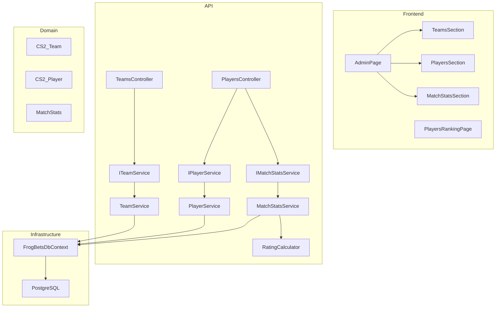
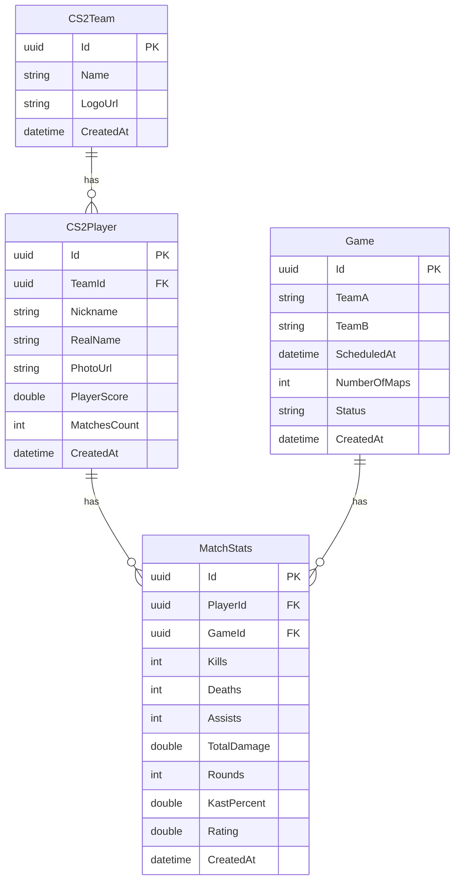

# Design Técnico — Player Rating System

## Overview

O sistema de rating de jogadores de CS2 adiciona três novas entidades ao FrogBets (`CS2_Team`, `CS2_Player`, `MatchStats`) e um componente puro de cálculo (`RatingCalculator`). Administradores cadastram times e jogadores, registram estatísticas por partida e o sistema calcula automaticamente o rating individual e atualiza o score acumulado de cada jogador. Um endpoint público expõe o ranking ordenado por score.

A feature se integra ao projeto existente seguindo os padrões já estabelecidos: Controllers → Services (com interfaces) → DbContext, autenticação JWT com claim `isAdmin`, e frontend React com Axios.

---

## Architecture



O `RatingCalculator` é um componente estático puro (sem dependências de I/O), o que o torna diretamente testável via property-based testing.

---

## Components and Interfaces

### Backend — Serviços C#

```csharp
// ITeamService.cs
public interface ITeamService
{
    Task<CS2TeamDto> CreateTeamAsync(CreateTeamRequest request);
    Task<IReadOnlyList<CS2TeamDto>> GetTeamsAsync();
}

public record CreateTeamRequest(string Name, string? LogoUrl);
public record CS2TeamDto(Guid Id, string Name, string? LogoUrl, DateTime CreatedAt);
```

```csharp
// IPlayerService.cs
public interface IPlayerService
{
    Task<CS2PlayerDto> CreatePlayerAsync(CreatePlayerRequest request);
    Task<IReadOnlyList<CS2PlayerDto>> GetPlayersAsync();
    Task<IReadOnlyList<PlayerRankingItemDto>> GetRankingAsync();
}

public record CreatePlayerRequest(string Nickname, string? RealName, Guid TeamId, string? PhotoUrl);
public record CS2PlayerDto(Guid Id, string Nickname, string? RealName, Guid TeamId, string TeamName,
    string? PhotoUrl, double PlayerScore, int MatchesCount, DateTime CreatedAt);
public record PlayerRankingItemDto(int Position, Guid PlayerId, string Nickname, string TeamName,
    double PlayerScore, int MatchesCount);
```

```csharp
// IMatchStatsService.cs
public interface IMatchStatsService
{
    Task<MatchStatsDto> RegisterStatsAsync(RegisterStatsRequest request);
}

public record RegisterStatsRequest(
    Guid PlayerId, Guid GameId,
    int Kills, int Deaths, int Assists,
    double TotalDamage, int Rounds, double KastPercent);
public record MatchStatsDto(Guid Id, Guid PlayerId, Guid GameId, int Kills, int Deaths,
    int Assists, double TotalDamage, int Rounds, double KastPercent, double Rating, DateTime CreatedAt);
```

### RatingCalculator — Componente Puro

```csharp
// RatingCalculator.cs — sem dependências externas, estático e testável
public static class RatingCalculator
{
    public static double Calculate(int kills, int deaths, int assists,
        double totalDamage, int rounds, double kastPercent)
    {
        double kpr    = (double)kills / rounds;
        double dpr    = (double)deaths / rounds;
        double adr    = totalDamage / rounds;
        double impact = kpr + ((double)assists / rounds * 0.4);

        return 0.0073 * kastPercent
             + 0.3591 * kpr
             + (-0.5329) * dpr
             + 0.2372 * impact
             + 0.0032 * adr
             + 0.1587;
    }
}
```

### Controllers

- `TeamsController` — `POST /api/teams`, `GET /api/teams`
- `PlayersController` — `POST /api/players`, `GET /api/players`, `GET /api/players/ranking`, `POST /api/players/{id}/stats`

### Frontend — Componentes React

- `TeamsSection` — formulário de criação + listagem de times (adicionado ao `AdminPage`)
- `PlayersSection` — formulário de criação + listagem de jogadores (adicionado ao `AdminPage`)
- `MatchStatsSection` — formulário de registro de stats por partida (adicionado ao `AdminPage`)
- `PlayersRankingPage` — página pública de ranking (`/players/ranking`)

---

## Data Models

### Entidades de Domínio

```csharp
// CS2_Team
public class CS2Team
{
    public Guid Id { get; set; }
    public string Name { get; set; } = string.Empty;       // unique, max 100
    public string? LogoUrl { get; set; }
    public DateTime CreatedAt { get; set; }
    public ICollection<CS2Player> Players { get; set; } = new List<CS2Player>();
}

// CS2_Player
public class CS2Player
{
    public Guid Id { get; set; }
    public Guid TeamId { get; set; }
    public string Nickname { get; set; } = string.Empty;   // unique, max 100
    public string? RealName { get; set; }
    public string? PhotoUrl { get; set; }
    public double PlayerScore { get; set; }                // acumulado
    public int MatchesCount { get; set; }
    public DateTime CreatedAt { get; set; }
    public CS2Team Team { get; set; } = null!;
    public ICollection<MatchStats> Stats { get; set; } = new List<MatchStats>();
}

// MatchStats
public class MatchStats
{
    public Guid Id { get; set; }
    public Guid PlayerId { get; set; }
    public Guid GameId { get; set; }
    public int Kills { get; set; }
    public int Deaths { get; set; }
    public int Assists { get; set; }
    public double TotalDamage { get; set; }
    public int Rounds { get; set; }
    public double KastPercent { get; set; }                // 0–100
    public double Rating { get; set; }                     // calculado
    public DateTime CreatedAt { get; set; }
    public CS2Player Player { get; set; } = null!;
    public Game Game { get; set; } = null!;
}
```

### Diagrama ER



### Configuração EF Core (adições ao DbContext)

```csharp
public DbSet<CS2Team> CS2Teams => Set<CS2Team>();
public DbSet<CS2Player> CS2Players => Set<CS2Player>();
public DbSet<MatchStats> MatchStats => Set<MatchStats>();
```

Constraints relevantes:
- `CS2Team.Name` — unique index
- `CS2Player.Nickname` — unique index
- `MatchStats(PlayerId, GameId)` — unique index (evita duplicata)
- `CS2Player.PlayerScore` — default 0.0
- `MatchStats.KastPercent` — validado no serviço (0–100)
- `MatchStats.Rounds` — validado no serviço (> 0)

### Migração EF Core

Uma única migração `AddPlayerRatingSystem` adicionará as três tabelas com seus índices e constraints de FK.

---

## API Endpoints

### Teams

| Método | Rota | Auth | Descrição |
|--------|------|------|-----------|
| `POST` | `/api/teams` | Admin | Cria um novo time |
| `GET` | `/api/teams` | Admin | Lista todos os times |

**POST /api/teams — Request**
```json
{ "name": "FURIA", "logoUrl": "https://..." }
```
**Response 201**
```json
{ "id": "uuid", "name": "FURIA", "logoUrl": "https://...", "createdAt": "..." }
```
**Erros:** `400 INVALID_TEAM_NAME`, `409 TEAM_NAME_ALREADY_EXISTS`

---

### Players

| Método | Rota | Auth | Descrição |
|--------|------|------|-----------|
| `POST` | `/api/players` | Admin | Cria um novo jogador |
| `GET` | `/api/players` | Admin | Lista todos os jogadores |
| `GET` | `/api/players/ranking` | Público | Ranking ordenado por score |
| `POST` | `/api/players/{id}/stats` | Admin | Registra stats de uma partida |

**POST /api/players — Request**
```json
{ "nickname": "kscerato", "realName": "Kaike Cerato", "teamId": "uuid", "photoUrl": "https://..." }
```
**Response 201**
```json
{ "id": "uuid", "nickname": "kscerato", "teamName": "FURIA", "playerScore": 0.0, "matchesCount": 0, ... }
```
**Erros:** `400 INVALID_PLAYER_DATA`, `404 TEAM_NOT_FOUND`, `409 PLAYER_NICKNAME_ALREADY_EXISTS`

---

**GET /api/players/ranking — Response 200**
```json
[
  { "position": 1, "playerId": "uuid", "nickname": "kscerato", "teamName": "FURIA", "playerScore": 12.4521, "matchesCount": 8 },
  ...
]
```

---

**POST /api/players/{id}/stats — Request**
```json
{
  "gameId": "uuid",
  "kills": 24, "deaths": 14, "assists": 3,
  "totalDamage": 2100.0, "rounds": 26, "kastPercent": 76.9
}
```
**Response 201**
```json
{ "id": "uuid", "playerId": "uuid", "gameId": "uuid", "rating": 1.1423, ... }
```
**Erros:** `400 INVALID_ROUNDS_COUNT`, `400 INVALID_KAST_VALUE`, `404 RESOURCE_NOT_FOUND`, `409 STATS_ALREADY_REGISTERED`

---

## Correctness Properties

*A property is a characteristic or behavior that should hold true across all valid executions of a system — essentially, a formal statement about what the system should do. Properties serve as the bridge between human-readable specifications and machine-verifiable correctness guarantees.*

O `RatingCalculator` é um componente puro (sem I/O, sem estado) e é o núcleo computacional desta feature. É o candidato ideal para property-based testing. As propriedades abaixo cobrem determinismo, corretude da fórmula, acumulação de score e ordenação do ranking.

**Reflection sobre redundância:**
- As propriedades 4.1–4.4 (KPR, DPR, ADR, Impact individualmente) são subsumedidas pela propriedade da fórmula completa (4.5), pois se a fórmula completa está correta com inputs aleatórios, os sub-cálculos também estão. Portanto, consolidamos em uma única propriedade de corretude da fórmula.
- A propriedade de ordenação do ranking (5.1) subsume a de consistência pós-atualização (5.3), pois se o ranking sempre está ordenado corretamente, a consistência após atualização é garantida.
- As propriedades de completude dos campos (5.2) e de ordenação (5.1) são independentes e ambas necessárias.

---

### Property 1: Determinismo do RatingCalculator

*For any* conjunto válido de estatísticas de partida (kills ≥ 0, deaths ≥ 0, assists ≥ 0, totalDamage ≥ 0, rounds > 0, kastPercent ∈ [0, 100]), chamar `RatingCalculator.Calculate()` múltiplas vezes com os mesmos argumentos SHALL sempre retornar o mesmo valor numérico.

**Validates: Requirements 4.6**

---

### Property 2: Corretude da fórmula de rating

*For any* conjunto válido de estatísticas de partida, o valor retornado por `RatingCalculator.Calculate()` SHALL ser numericamente igual (com tolerância de 1e-9) ao resultado da fórmula de referência calculada inline:
`rating = 0.0073 * kast + 0.3591 * (kills/rounds) + (-0.5329) * (deaths/rounds) + 0.2372 * (kills/rounds + assists/rounds * 0.4) + 0.0032 * (totalDamage/rounds) + 0.1587`

**Validates: Requirements 3.3, 4.1, 4.2, 4.3, 4.4, 4.5**

---

### Property 3: Acumulação do PlayerScore

*For any* sequência de N conjuntos válidos de estatísticas registradas para o mesmo jogador, o `PlayerScore` final do jogador SHALL ser igual à soma dos N ratings calculados individualmente pelo `RatingCalculator`.

**Validates: Requirements 3.4**

---

### Property 4: Rejeição de rounds inválidos

*For any* conjunto de estatísticas onde `rounds ≤ 0`, o serviço de registro de stats SHALL rejeitar a requisição com erro `INVALID_ROUNDS_COUNT` e o `PlayerScore` do jogador SHALL permanecer inalterado.

**Validates: Requirements 3.6**

---

### Property 5: Rejeição de KAST fora do intervalo

*For any* conjunto de estatísticas onde `kastPercent < 0` ou `kastPercent > 100`, o serviço de registro de stats SHALL rejeitar a requisição com erro `INVALID_KAST_VALUE` e o `PlayerScore` do jogador SHALL permanecer inalterado.

**Validates: Requirements 3.7**

---

### Property 6: Ordenação do ranking

*For any* conjunto de N jogadores com scores distintos, o endpoint `GET /api/players/ranking` SHALL retornar a lista onde para todo par de posições consecutivas i e i+1, `ranking[i].playerScore ≥ ranking[i+1].playerScore`.

**Validates: Requirements 5.1, 5.3**

---

### Property 7: Completude dos campos do ranking

*For any* jogador cadastrado com stats registradas, cada item retornado pelo endpoint de ranking SHALL conter todos os campos obrigatórios: `position`, `playerId`, `nickname`, `teamName`, `playerScore` e `matchesCount`, com valores não-nulos.

**Validates: Requirements 5.2**

---

## Error Handling

Todos os erros seguem o padrão já estabelecido no projeto:

```json
{ "error": { "code": "ERROR_CODE", "message": "Mensagem legível" } }
```

| Código | HTTP | Situação |
|--------|------|----------|
| `INVALID_TEAM_NAME` | 400 | Nome de time vazio/ausente |
| `TEAM_NAME_ALREADY_EXISTS` | 409 | Nome de time duplicado |
| `INVALID_PLAYER_DATA` | 400 | Nickname vazio ou TeamId ausente |
| `PLAYER_NICKNAME_ALREADY_EXISTS` | 409 | Nickname duplicado |
| `TEAM_NOT_FOUND` | 404 | TeamId não encontrado |
| `INVALID_ROUNDS_COUNT` | 400 | Rounds ≤ 0 |
| `INVALID_KAST_VALUE` | 400 | KAST fora de [0, 100] |
| `STATS_ALREADY_REGISTERED` | 409 | Stats duplicadas para mesmo player+game |
| `RESOURCE_NOT_FOUND` | 404 | PlayerId ou GameId não encontrado |

Exceções de domínio são lançadas pelos serviços e capturadas nos controllers com `try/catch`, seguindo o padrão de `GamesController`.

---

## Testing Strategy

### Abordagem Dual

A feature usa dois tipos complementares de teste:

**Testes de unidade (xUnit)** — para casos específicos, edge cases e integração entre camadas:
- Criação de time com nome duplicado retorna 409
- Criação de jogador com TeamId inexistente retorna 404
- Registro de stats duplicadas retorna 409
- Endpoint de ranking sem jogadores retorna lista vazia com 200
- Endpoints de escrita retornam 401 sem token e 403 com token não-admin

**Testes de propriedade (FsCheck + xUnit)** — para as 7 propriedades de corretude acima:
- Biblioteca: **FsCheck** (pacote `FsCheck.Xunit`)
- Mínimo de **100 iterações** por propriedade
- As propriedades 1 e 2 testam o `RatingCalculator` diretamente (sem I/O)
- As propriedades 3–7 testam os serviços com DbContext em memória (`UseInMemoryDatabase`)
- Cada teste de propriedade deve ter um comentário de tag no formato:
  `// Feature: player-rating-system, Property N: <texto da propriedade>`

### Geradores FsCheck para inputs válidos

```csharp
// Gerador de stats válidas
var validStats = Arb.Generate<(int kills, int deaths, int assists, double damage, int rounds, double kast)>()
    .Where(s => s.rounds > 0 && s.kast >= 0 && s.kast <= 100
             && s.kills >= 0 && s.deaths >= 0 && s.assists >= 0 && s.damage >= 0);
```

### Cobertura por requisito

| Requisito | Tipo de teste |
|-----------|---------------|
| 1 (Times) | Unidade + Property (1.2, 1.4) |
| 2 (Jogadores) | Unidade + Property (2.2, 2.5) |
| 3 (Stats) | Unidade + Property (3.2, 3.4, 3.6, 3.7) |
| 4 (RatingCalculator) | Property (todas as 7 propriedades) |
| 5 (Ranking) | Unidade + Property (5.1, 5.2) |
| 6 (Segurança) | Unidade (exemplos de 401/403) |
