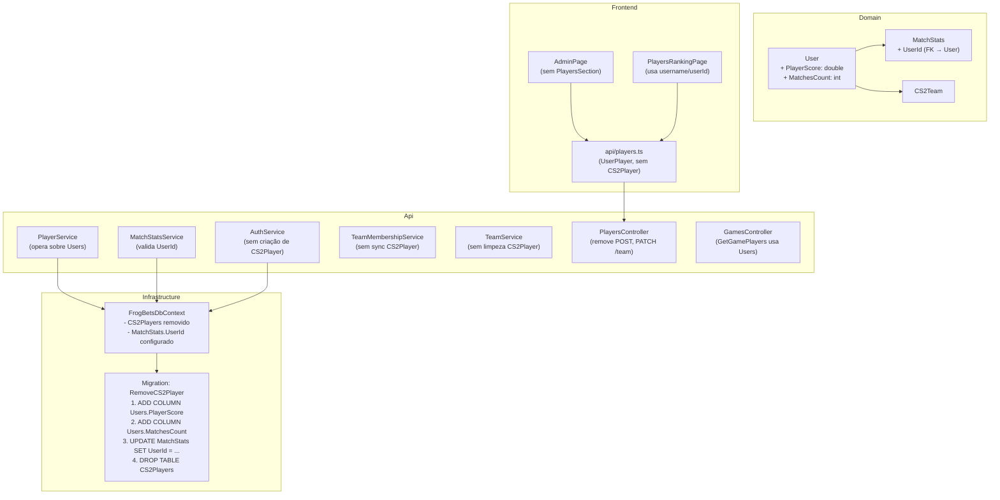

# Design Document — remove-cs2player

## Overview

Esta feature remove completamente a entidade `CS2Player` do sistema FrogBets, unificando o modelo de domínio em `User` + `CS2Team`. A entidade `CS2Player` é redundante: todo usuário registrado já é um player. A refatoração move `PlayerScore` e `MatchesCount` para `User`, faz `MatchStats` referenciar `UserId` diretamente, e simplifica o frontend removendo o cadastro manual de jogadores.

**Motivação:** A existência de `CS2Player` como intermediário entre `User` e `CS2Team` cria duplicidade de dados (Nickname = Username, PlayerScore duplicado), lógica de sincronização frágil em `AuthService`, `TeamMembershipService` e `TeamService`, e endpoints desnecessários no `PlayersController`. Remover essa camada simplifica o modelo, elimina bugs de sincronização e reduz a superfície de código a manter.

**Decisão de design:** O campo `PlayerId` em `MatchStats` é renomeado para `UserId` via migration EF Core. A migration deve copiar `CS2Player.UserId → MatchStats.UserId` antes de dropar a tabela `CS2Players`, preservando o histórico de estatísticas.

---

## Architecture

O sistema segue a arquitetura em camadas existente: Domain → Infrastructure → Api → Frontend.



---

## Components and Interfaces

### Domain — User (modificado)

```csharp
public class User
{
    // campos existentes...
    public double PlayerScore  { get; set; } = 0.0;  // NOVO
    public int    MatchesCount { get; set; } = 0;    // NOVO
    public ICollection<MatchStats> Stats { get; set; } = new List<MatchStats>(); // NOVO nav
}
```

### Domain — MatchStats (modificado)

```csharp
public class MatchStats
{
    public Guid Id          { get; set; }
    public Guid UserId      { get; set; }  // renomeado de PlayerId
    public Guid MapResultId { get; set; }
    // demais campos inalterados...

    public User      User      { get; set; } = null!;  // nav atualizada
    public MapResult MapResult { get; set; } = null!;
}
```

### Domain — CS2Player (removido)

O arquivo `src/FrogBets.Domain/Entities/CS2Player.cs` é deletado. A referência `CS2Team.Players` (navigation collection) também é removida de `CS2Team`.

### Infrastructure — FrogBetsDbContext (modificado)

- Remover `DbSet<CS2Player> CS2Players`
- Remover bloco de configuração `CS2Player` em `OnModelCreating`
- Remover relação `CS2Team → CS2Player` (Players collection)
- Adicionar configuração de `User.PlayerScore` e `User.MatchesCount` com defaults
- Atualizar configuração de `MatchStats`: índice único em `(UserId, MapResultId)`, FK `→ User` com `OnDelete(DeleteBehavior.Restrict)`

```csharp
// User — novos campos
modelBuilder.Entity<User>(e =>
{
    // ... configurações existentes ...
    e.Property(u => u.PlayerScore).HasDefaultValue(0.0);
    e.Property(u => u.MatchesCount).HasDefaultValue(0);
    e.HasMany(u => u.Stats)
        .WithOne(s => s.User)
        .HasForeignKey(s => s.UserId)
        .OnDelete(DeleteBehavior.Restrict);
});

// MatchStats — FK atualizada
modelBuilder.Entity<MatchStats>(e =>
{
    e.HasKey(s => s.Id);
    e.HasIndex(s => new { s.UserId, s.MapResultId }).IsUnique();
    e.Property(s => s.CreatedAt).IsRequired();
});
```

### Infrastructure — Migration

A migration `RemoveCS2Player` executa na seguinte ordem para preservar dados históricos:

```sql
-- 1. Adicionar novos campos em Users
ALTER TABLE "Users" ADD COLUMN "PlayerScore"  double precision NOT NULL DEFAULT 0.0;
ALTER TABLE "Users" ADD COLUMN "MatchesCount" integer          NOT NULL DEFAULT 0;

-- 2. Copiar PlayerScore e MatchesCount de CS2Players para Users
UPDATE "Users" u
SET "PlayerScore"  = p."PlayerScore",
    "MatchesCount" = p."MatchesCount"
FROM "CS2Players" p
WHERE p."UserId" = u."Id";

-- 3. Adicionar coluna UserId em MatchStats (nullable temporariamente)
ALTER TABLE "MatchStats" ADD COLUMN "UserId" uuid NULL;

-- 4. Preencher UserId a partir do CS2Player vinculado
UPDATE "MatchStats" ms
SET "UserId" = p."UserId"
FROM "CS2Players" p
WHERE p."Id" = ms."PlayerId"
  AND p."UserId" IS NOT NULL;

-- 5. Tornar UserId NOT NULL e adicionar FK
ALTER TABLE "MatchStats" ALTER COLUMN "UserId" SET NOT NULL;
ALTER TABLE "MatchStats" ADD CONSTRAINT "FK_MatchStats_Users_UserId"
    FOREIGN KEY ("UserId") REFERENCES "Users"("Id") ON DELETE RESTRICT;

-- 6. Remover índice antigo e criar novo índice único
DROP INDEX "IX_MatchStats_PlayerId_MapResultId";
CREATE UNIQUE INDEX "IX_MatchStats_UserId_MapResultId"
    ON "MatchStats" ("UserId", "MapResultId");

-- 7. Remover coluna PlayerId e FK antiga
ALTER TABLE "MatchStats" DROP CONSTRAINT "FK_MatchStats_CS2Players_PlayerId";
ALTER TABLE "MatchStats" DROP COLUMN "PlayerId";

-- 8. Dropar tabela CS2Players
DROP TABLE "CS2Players";
```

**Nota:** MatchStats com `PlayerId` referenciando um `CS2Player` sem `UserId` (legados sem vínculo) serão tratados na migration: se `CS2Player.UserId IS NULL`, a linha de MatchStats ficará com `UserId` nulo temporariamente e será excluída antes de tornar a coluna NOT NULL (dados órfãos sem usuário vinculado não têm valor histórico).

### Api — IPlayerService / PlayerService (modificado)

```csharp
// DTOs atualizados
public record UserPlayerDto(
    Guid    Id,
    string  Username,
    Guid?   TeamId,
    string? TeamName,
    double  PlayerScore,
    int     MatchesCount,
    DateTime CreatedAt);

public record PlayerRankingItemDto(
    int    Position,
    Guid   UserId,      // era PlayerId
    string Username,    // era Nickname
    string TeamName,
    double PlayerScore,
    int    MatchesCount);

public interface IPlayerService
{
    Task<IReadOnlyList<UserPlayerDto>>        GetPlayersAsync();
    Task<IReadOnlyList<UserPlayerDto>>        GetPlayersByTeamAsync(Guid teamId);
    Task<IReadOnlyList<PlayerRankingItemDto>> GetRankingAsync();
    // CreatePlayerAsync e AssignTeamAsync REMOVIDOS
}
```

`PlayerService.GetPlayersAsync()` passa a consultar `_db.Users` filtrando por `TeamId != null`, incluindo `Team`.

`PlayerService.GetRankingAsync()` ordena `Users` por `PlayerScore` descrescente.

### Api — IMatchStatsService / MatchStatsService (modificado)

```csharp
// RegisterStatsRequest: PlayerId renomeado para UserId
public record RegisterStatsRequest(
    Guid UserId,        // era PlayerId
    Guid MapResultId,
    int Kills, int Deaths, int Assists,
    double TotalDamage, double KastPercent);

// MatchStatsDto: PlayerId mantido por compatibilidade de contrato (mapeado de UserId)
public record MatchStatsDto(
    Guid Id, Guid PlayerId, Guid MapResultId, ...);
```

`MatchStatsService.RegisterStatsAsync()`:
- Valida `_db.Users.AnyAsync(u => u.Id == request.UserId)` em vez de `CS2Players`
- Incrementa `user.PlayerScore` e `user.MatchesCount` em vez de `player.*`

### Api — AuthService (modificado)

Remove o bloco `// 2. INSERT CS2Player` do método `RegisterAsync`. Adiciona inicialização explícita de `PlayerScore = 0.0` e `MatchesCount = 0` na criação do `User` (já são defaults, mas explicitados para clareza).

### Api — TeamMembershipService (modificado)

Remove o bloco de sync com `CS2Players` em `MoveUserAsync` (linhas que criam ou atualizam `CS2Player`). O método passa a atualizar apenas `User.TeamId`.

### Api — TeamService (modificado)

Remove a chamada `ExecuteUpdateAsync` que limpava `CS2Player.TeamId` em `DeleteTeamAsync`.

### Api — PlayersController (modificado)

- Remove `POST /api/players` (método `CreatePlayer`)
- Remove `PATCH /api/players/{id}/team` (método `AssignTeam`)
- Remove records `CreatePlayerBody` e `AssignTeamBody`
- Mantém `GET /api/players`, `GET /api/players/ranking`, `POST /api/players/{id}/stats`, `GET /api/players/{id}/stats`
- `RegisterStats` e `GetStats` passam a usar `UserId` como `{id}`

### Api — GamesController (modificado)

`GetGamePlayers` passa a consultar `_db.Users` em vez de `_db.CS2Players`:

```csharp
var players = await _db.Users
    .Include(u => u.Team)
    .AsNoTracking()
    .Where(u => u.TeamId.HasValue && teamIds.Contains(u.TeamId.Value))
    .OrderBy(u => u.Team!.Name).ThenBy(u => u.Username)
    .Select(u => new { id = u.Id, nickname = u.Username, teamName = u.Team!.Name })
    .ToListAsync();
```

### Frontend — api/players.ts (modificado)

```typescript
// REMOVIDO: interface CS2Player
// ADICIONADO:
export interface UserPlayer {
  id: string;
  username: string;
  teamId: string | null;
  teamName: string | null;
  playerScore: number;
  matchesCount: number;
  createdAt: string;
}

// ATUALIZADO:
export interface PlayerRankingItem {
  position: number;
  userId: string;      // era playerId
  username: string;    // era nickname
  teamName: string;
  playerScore: number;
  matchesCount: number;
}

export interface GamePlayer {
  id: string;
  username: string;    // era nickname
  teamName: string;
}

// REMOVIDO: createPlayer, assignTeam
// getPlayers retorna UserPlayer[] em vez de CS2Player[]
// getPlayersByTeam retorna UserPlayer[] em vez de CS2Player[]
```

### Frontend — AdminPage (modificado)

- Remove `PlayersSection` e `sec-players` completamente
- Remove item `{ id: 'sec-players', label: '👤 Jogadores' }` de `NAV_ITEMS_BASE`
- Atualiza `MatchStatsSection`: usa `getGamePlayers` (que retorna `username`) em vez de `getPlayers` (que retornava `nickname`)
- Remove importações de `CS2Player`, `getPlayers`, `createPlayer`

### Frontend — PlayersRankingPage (modificado)

```tsx
// ANTES:
<tr key={item.playerId}>
  <td>{item.nickname}</td>

// DEPOIS:
<tr key={item.userId}>
  <td>{item.username}</td>
```

---

## Data Models

### Antes (estado atual)

```
Users: Id, Username, PasswordHash, IsAdmin, VirtualBalance, ReservedBalance,
       WinsCount, LossesCount, TeamId, IsTeamLeader, CreatedAt

CS2Players: Id, UserId (FK→Users), TeamId (FK→CS2Teams), Nickname, RealName,
            PhotoUrl, PlayerScore, MatchesCount, CreatedAt

MatchStats: Id, PlayerId (FK→CS2Players), MapResultId (FK→MapResults),
            Kills, Deaths, Assists, TotalDamage, KastPercent, Rating, CreatedAt
```

### Depois (estado alvo)

```
Users: Id, Username, PasswordHash, IsAdmin, VirtualBalance, ReservedBalance,
       WinsCount, LossesCount, TeamId, IsTeamLeader, CreatedAt,
       PlayerScore (NEW, default 0.0), MatchesCount (NEW, default 0)

MatchStats: Id, UserId (FK→Users, RENAMED from PlayerId), MapResultId (FK→MapResults),
            Kills, Deaths, Assists, TotalDamage, KastPercent, Rating, CreatedAt

-- CS2Players: DROPPED
```

### Índices e constraints

| Tabela | Índice | Tipo |
|---|---|---|
| `Users` | `IX_Users_Username` | UNIQUE (existente) |
| `MatchStats` | `IX_MatchStats_UserId_MapResultId` | UNIQUE (novo, substitui PlayerId) |
| `MatchStats` | `FK_MatchStats_Users_UserId` | FK com RESTRICT (novo) |

---

## Correctness Properties

*A property is a characteristic or behavior that should hold true across all valid executions of a system — essentially, a formal statement about what the system should do. Properties serve as the bridge between human-readable specifications and machine-verifiable correctness guarantees.*

### Property 1: Acumulação de PlayerScore é round-trip

*For any* usuário válido e sequência de N registros de `MatchStats` com `MapResultId`s distintos, o `User.PlayerScore` final deve ser igual à soma dos ratings individuais retornados por cada `MatchStatsDto`, e `User.MatchesCount` deve ser igual a N.

**Validates: Requirements 2.2, 2.6, 13.3, 13.5**

### Property 2: Estatísticas duplicadas são rejeitadas

*For any* par válido `(UserId, MapResultId)`, registrar `MatchStats` duas vezes deve sempre lançar `InvalidOperationException("STATS_ALREADY_REGISTERED")` na segunda chamada, sem alterar `User.PlayerScore` ou `User.MatchesCount`.

**Validates: Requirements 2.4**

### Property 3: KAST fora do intervalo [0, 100] é rejeitado

*For any* valor de `KastPercent` menor que 0 ou maior que 100, `RegisterStatsAsync` deve lançar `InvalidOperationException("INVALID_KAST_VALUE")`.

**Validates: Requirements 2.5**

### Property 4: UserId inválido é rejeitado

*For any* GUID que não corresponda a um `User` existente no banco, `RegisterStatsAsync` deve lançar `InvalidOperationException("RESOURCE_NOT_FOUND")`.

**Validates: Requirements 2.1, 2.3**

### Property 5: Listagem de jogadores filtra por TeamId não nulo

*For any* conjunto de usuários com e sem `TeamId`, `GetPlayersAsync()` deve retornar exatamente os usuários com `TeamId != null`, expondo `Username` como identificador de exibição.

**Validates: Requirements 3.1, 3.6**

### Property 6: Ranking é ordenado por PlayerScore decrescente

*For any* conjunto de usuários com `TeamId` não nulo e `PlayerScore`s distintos, `GetRankingAsync()` deve retornar a lista ordenada de forma que `ranking[i].PlayerScore >= ranking[i+1].PlayerScore` para todo i, com posições sequenciais a partir de 1.

**Validates: Requirements 3.3, 13.4**

### Property 7: Registro inicializa User sem criar CS2Player

*For any* registro válido (com ou sem `teamId`), `AuthService.RegisterAsync` deve criar exatamente um `User` com `PlayerScore == 0.0` e `MatchesCount == 0`, sem criar nenhum registro em `CS2Players`.

**Validates: Requirements 4.1, 4.3, 13.1**

### Property 8: Movimentação de time atualiza apenas User.TeamId

*For any* usuário e `destinationTeamId` (incluindo null), `TeamMembershipService.MoveUserAsync` deve atualizar `User.TeamId` para o valor fornecido e `User.IsTeamLeader` para false (quando removido), sem criar ou modificar registros de `CS2Player`.

**Validates: Requirements 5.1, 5.2**

### Property 9: Exclusão de time limpa TeamId de todos os membros

*For any* time com N membros (incluindo líderes), `TeamService.DeleteTeamAsync` deve resultar em todos os membros com `User.TeamId == null` e `User.IsTeamLeader == false`.

**Validates: Requirements 6.1**

---

## Error Handling

| Situação | Exceção | Código HTTP |
|---|---|---|
| `UserId` não encontrado em `RegisterStatsAsync` | `InvalidOperationException("RESOURCE_NOT_FOUND")` | 404 |
| `MapResultId` não encontrado | `InvalidOperationException("MAP_RESULT_NOT_FOUND")` | 404 |
| Stats duplicadas `(UserId, MapResultId)` | `InvalidOperationException("STATS_ALREADY_REGISTERED")` | 409 |
| `KastPercent` fora de [0, 100] | `InvalidOperationException("INVALID_KAST_VALUE")` | 400 |
| `teamId` inválido no registro | `InvalidOperationException("TEAM_NOT_FOUND")` | 404 |
| Jogo não encontrado em `GetGamePlayers` | retorna 404 com `GAME_NOT_FOUND` | 404 |

O formato de erro padrão é mantido: `{ "error": { "code": "...", "message": "..." } }`.

**Compatibilidade de contrato:** O campo `PlayerId` no `MatchStatsDto` é mantido com o mesmo nome para não quebrar clientes existentes — internamente ele é mapeado de `UserId`. Isso evita uma breaking change no contrato da API enquanto o frontend é atualizado.

---

## Testing Strategy

### Abordagem dual

- **Testes unitários (xUnit):** exemplos específicos, casos de borda, verificações de contrato
- **Testes property-based (FsCheck):** propriedades universais com 100+ iterações

### Testes a reescrever

**`UserPlayerUnificationTests.cs`** — reescrever completamente:
- Remover todos os helpers `SeedPlayerAsync` que criam `CS2Player`
- Adicionar helper `SeedUserWithTeamAsync` que cria `User` com `TeamId`
- Cobrir Property 7: registro sem CS2Player, com inicialização correta
- Cobrir Property 5: listagem filtra por TeamId

**`PlayerRatingSystemTests.cs`** — atualizar:
- Substituir `SeedPlayerAsync` (CS2Player) por `SeedUserWithTeamAsync` (User)
- Atualizar asserções de `CS2Players.Find(player.Id)` para `Users.Find(user.Id)`
- Cobrir Property 1: acumulação de PlayerScore em User
- Cobrir Property 6: ranking ordenado por User.PlayerScore
- Manter testes de `RatingCalculator` (sem alteração)

### Configuração dos property tests

```csharp
// Feature: remove-cs2player, Property N: <descrição>
[Property(MaxTest = 100)]
public Property NomeDaPropriedade() { ... }
```

### Testes de integração

- `GET /api/players` retorna `UserPlayer[]` com `username`
- `GET /api/players/ranking` retorna `PlayerRankingItem[]` com `userId` e `username`
- `POST /api/players/{userId}/stats` valida `UserId` em vez de `CS2Player.Id`
- `GET /api/games/{id}/players` retorna usuários dos times

### Frontend

- `npx tsc --noEmit` deve passar sem erros após as alterações de interface
- Testes de componente para `PlayersRankingPage` verificando que `username` é exibido
- Testes de componente para `AdminPage` verificando ausência de `PlayersSection`

### Checklist de qualidade

- [ ] `dotnet test` passa com zero falhas
- [ ] `npx tsc --noEmit` no frontend passa sem erros
- [ ] Migration aplicada em banco de desenvolvimento sem perda de dados
- [ ] `docs/TECHNICAL.md` atualizado com novos campos de `User` e endpoints modificados
- [ ] `domain-model.md` (steering) atualizado para remover `CS2Player` e refletir novos campos de `User`
