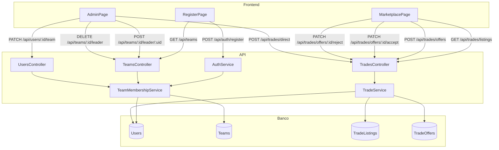

# Design Técnico — Team Membership

## Visão Geral

Esta feature introduz o conceito de **pertencimento a times** para os usuários da plataforma FrogBets. Um usuário (`User`) pode ser vinculado a um `CS2Team` no cadastro ou posteriormente. Além disso, é criado o papel de **Líder de Time** (`IsTeamLeader`), que possui acesso privilegiado ao novo **Marketplace de Trocas** — seção separada do marketplace de apostas P2P já existente.

Os principais blocos de trabalho são:

1. Migração do banco de dados (novos campos em `Users`, novas tabelas `TradeListings` e `TradeOffers`)
2. `TeamMembershipService` — vínculo de usuários a times e gestão de líderes
3. `TradeService` — marketplace de trocas (disponibilidade, ofertas, aceitação, troca direta)
4. Novos endpoints REST e ajuste no `GET /api/teams`
5. Ajuste no `AuthService.RegisterAsync` para aceitar `teamId` opcional
6. Atualizações no frontend: `RegisterPage`, `MarketplacePage` e `AdminPage`

O Requisito 8 (apostas por qualquer usuário autenticado) já está satisfeito pelo `BetsController` atual, que não possui verificação de `TeamId` ou `IsTeamLeader`. Nenhuma alteração é necessária nesse fluxo.

---

## Arquitetura



---

## Componentes e Interfaces

### TeamMembershipService

```csharp
public interface ITeamMembershipService
{
    // Designar líder (admin)
    Task AssignLeaderAsync(Guid teamId, Guid userId);
    // Remover líder (admin)
    Task RemoveLeaderAsync(Guid teamId);
    // Mover membro de time (líder do time de origem ou admin)
    Task MoveUserAsync(Guid requesterId, bool requesterIsAdmin, Guid targetUserId, Guid? destinationTeamId);
}
```

**Erros lançados (InvalidOperationException com código):**

| Código | Situação |
|---|---|
| `USER_NOT_FOUND` | Usuário alvo não existe |
| `TEAM_NOT_FOUND` | Time não existe |
| `USER_NOT_IN_TEAM` | Usuário não pertence ao time informado |
| `ALREADY_LEADER_OF_OTHER_TEAM` | Usuário já é líder de outro time |
| `FORBIDDEN` | Solicitante não tem permissão |

---

### TradeService

```csharp
public interface ITradeService
{
    // Listar membros disponíveis para troca
    Task<IReadOnlyList<TradeListingDto>> GetListingsAsync();
    // Marcar membro como disponível (líder do time do membro)
    Task AddListingAsync(Guid requesterId, Guid targetUserId);
    // Remover disponibilidade (líder do time do membro)
    Task RemoveListingAsync(Guid requesterId, Guid targetUserId);
    // Listar ofertas recebidas pelo time do líder (status Pendente)
    Task<IReadOnlyList<TradeOfferDto>> GetReceivedOffersAsync(Guid requesterId);
    // Criar oferta de troca
    Task<Guid> CreateOfferAsync(Guid requesterId, Guid offeredUserId, Guid targetUserId);
    // Aceitar oferta
    Task AcceptOfferAsync(Guid requesterId, Guid offerId);
    // Recusar oferta
    Task RejectOfferAsync(Guid requesterId, Guid offerId);
    // Troca direta (admin)
    Task DirectSwapAsync(Guid userAId, Guid userBId);
}
```

**Erros lançados:**

| Código | Situação |
|---|---|
| `USER_NOT_FOUND` | Usuário não existe |
| `TEAM_NOT_FOUND` | Time não existe |
| `FORBIDDEN` | Solicitante não tem permissão |
| `TARGET_NOT_AVAILABLE` | Membro alvo não está disponível para troca |
| `SAME_TEAM_TRADE` | Membros pertencem ao mesmo time |
| `OFFER_NOT_PENDING` | Oferta não está com status Pendente |
| `ALREADY_LISTED` | Membro já está marcado como disponível |

---

### Novos Endpoints

| Método | Rota | Autorização | Descrição |
|---|---|---|---|
| `GET` | `/api/teams` | Qualquer autenticado | Listar todos os times (remover restrição isAdmin) |
| `POST` | `/api/teams/{teamId}/leader/{userId}` | isAdmin | Designar líder |
| `DELETE` | `/api/teams/{teamId}/leader` | isAdmin | Remover líder |
| `PATCH` | `/api/users/{id}/team` | Líder ou isAdmin | Mover usuário de time |
| `GET` | `/api/trades/listings` | Qualquer autenticado | Listar disponíveis para troca |
| `POST` | `/api/trades/listings` | isTeamLeader ou isAdmin | Marcar membro como disponível |
| `DELETE` | `/api/trades/listings/{userId}` | isTeamLeader ou isAdmin | Remover disponibilidade |
| `GET` | `/api/trades/offers` | isTeamLeader | Listar ofertas recebidas |
| `POST` | `/api/trades/offers` | isTeamLeader ou isAdmin | Criar oferta de troca |
| `PATCH` | `/api/trades/offers/{id}/accept` | isTeamLeader | Aceitar oferta |
| `PATCH` | `/api/trades/offers/{id}/reject` | isTeamLeader | Recusar oferta |
| `POST` | `/api/trades/direct` | isAdmin | Troca direta |

A verificação de `isTeamLeader` é feita manualmente no controller lendo o campo `IsTeamLeader` do usuário no banco, seguindo o padrão existente de verificação de `isAdmin` via claim.

---

## Modelos de Dados

### Alterações na tabela `Users`

```sql
ALTER TABLE "Users"
  ADD COLUMN "TeamId" uuid NULL REFERENCES "Teams"("Id") ON DELETE SET NULL,
  ADD COLUMN "IsTeamLeader" boolean NOT NULL DEFAULT false;
```

### Nova tabela `TradeListings`

Registra membros marcados como disponíveis para troca.

```sql
CREATE TABLE "TradeListings" (
  "Id"        uuid PRIMARY KEY DEFAULT gen_random_uuid(),
  "UserId"    uuid NOT NULL REFERENCES "Users"("Id") ON DELETE CASCADE,
  "TeamId"    uuid NOT NULL REFERENCES "Teams"("Id") ON DELETE CASCADE,
  "CreatedAt" timestamptz NOT NULL DEFAULT now(),
  UNIQUE ("UserId")
);
```

### Nova tabela `TradeOffers`

Registra ofertas de troca entre times.

```sql
CREATE TABLE "TradeOffers" (
  "Id"             uuid PRIMARY KEY DEFAULT gen_random_uuid(),
  "OfferedUserId"  uuid NOT NULL REFERENCES "Users"("Id") ON DELETE CASCADE,
  "TargetUserId"   uuid NOT NULL REFERENCES "Users"("Id") ON DELETE CASCADE,
  "ProposerTeamId" uuid NOT NULL REFERENCES "Teams"("Id") ON DELETE CASCADE,
  "ReceiverTeamId" uuid NOT NULL REFERENCES "Teams"("Id") ON DELETE CASCADE,
  "Status"         varchar(20) NOT NULL DEFAULT 'Pending',
  "CreatedAt"      timestamptz NOT NULL DEFAULT now(),
  "UpdatedAt"      timestamptz NOT NULL DEFAULT now()
);
-- Status: 'Pending' | 'Accepted' | 'Rejected' | 'Cancelled'
```

### Entidades de domínio

```csharp
// src/FrogBets.Domain/Entities/User.cs — campos adicionados
public Guid? TeamId { get; set; }
public bool IsTeamLeader { get; set; } = false;
public CS2Team? Team { get; set; }

// src/FrogBets.Domain/Entities/TradeListing.cs
public class TradeListing
{
    public Guid Id { get; set; }
    public Guid UserId { get; set; }
    public User User { get; set; } = null!;
    public Guid TeamId { get; set; }
    public CS2Team Team { get; set; } = null!;
    public DateTime CreatedAt { get; set; }
}

// src/FrogBets.Domain/Entities/TradeOffer.cs
public class TradeOffer
{
    public Guid Id { get; set; }
    public Guid OfferedUserId { get; set; }
    public User OfferedUser { get; set; } = null!;
    public Guid TargetUserId { get; set; }
    public User TargetUser { get; set; } = null!;
    public Guid ProposerTeamId { get; set; }
    public CS2Team ProposerTeam { get; set; } = null!;
    public Guid ReceiverTeamId { get; set; }
    public CS2Team ReceiverTeam { get; set; } = null!;
    public TradeOfferStatus Status { get; set; } = TradeOfferStatus.Pending;
    public DateTime CreatedAt { get; set; }
    public DateTime UpdatedAt { get; set; }
}

public enum TradeOfferStatus { Pending, Accepted, Rejected, Cancelled }
```

### DTOs

```csharp
public record TradeListingDto(
    Guid UserId, string Username,
    Guid TeamId, string TeamName,
    DateTime CreatedAt);

public record TradeOfferDto(
    Guid Id,
    Guid OfferedUserId, string OfferedUsername,
    Guid TargetUserId, string TargetUsername,
    string ProposerTeamName, string ReceiverTeamName,
    string Status, DateTime CreatedAt);
```

### Configuração EF Core (FrogBetsDbContext)

```csharp
// Adicionar ao OnModelCreating:
modelBuilder.Entity<User>()
    .HasOne(u => u.Team)
    .WithMany()
    .HasForeignKey(u => u.TeamId)
    .OnDelete(DeleteBehavior.SetNull);

modelBuilder.Entity<TradeListing>()
    .HasIndex(tl => tl.UserId).IsUnique();

modelBuilder.Entity<TradeOffer>()
    .Property(o => o.Status)
    .HasConversion<string>();
```

---

## Propriedades de Corretude

*Uma propriedade é uma característica ou comportamento que deve ser verdadeiro em todas as execuções válidas de um sistema — essencialmente, uma declaração formal sobre o que o sistema deve fazer. Propriedades servem como ponte entre especificações legíveis por humanos e garantias de corretude verificáveis por máquina.*

### Propriedade 1: Cadastro com time preserva o TeamId

*Para qualquer* `teamId` válido informado no cadastro, o usuário criado deve ter exatamente esse `TeamId` armazenado.

**Valida: Requisito 1.3**

---

### Propriedade 2: Cadastro sem time resulta em TeamId nulo

*Para qualquer* combinação válida de username/password/inviteId sem `teamId`, o usuário criado deve ter `TeamId = null`.

**Valida: Requisito 1.2**

---

### Propriedade 3: TeamId inválido no cadastro é rejeitado

*Para qualquer* GUID que não corresponda a um time existente informado como `teamId` no cadastro, a operação deve ser rejeitada com código `TEAM_NOT_FOUND`.

**Valida: Requisito 1.4**

---

### Propriedade 4: Invariante de líder único por time

*Para qualquer* time, após qualquer sequência de operações de designação de líder, o número de usuários com `IsTeamLeader = true` e `TeamId` apontando para esse time deve ser no máximo 1.

**Valida: Requisitos 2.2, 2.3, 2.4**

---

### Propriedade 5: Remoção de líder limpa IsTeamLeader

*Para qualquer* usuário com `IsTeamLeader = true`, após remoção do papel de líder pelo administrador, `IsTeamLeader` deve ser `false`.

**Valida: Requisito 2.3**

---

### Propriedade 6: Remoção do time limpa IsTeamLeader automaticamente

*Para qualquer* usuário com `IsTeamLeader = true`, após remoção do seu vínculo de time, `IsTeamLeader` deve ser automaticamente definido como `false`.

**Valida: Requisito 2.7**

---

### Propriedade 7: Movimentação de membro atualiza TeamId corretamente

*Para qualquer* usuário membro de um time e qualquer time de destino válido, após movimentação autorizada (por líder do time de origem ou admin), o `TeamId` do usuário deve ser igual ao id do time de destino.

**Valida: Requisitos 3.1, 3.2**

---

### Propriedade 8: Remoção de time pelo admin define TeamId como nulo

*Para qualquer* usuário com `TeamId` preenchido, após remoção do vínculo pelo administrador (sem time de destino), `TeamId` deve ser `null`.

**Valida: Requisito 3.3**

---

### Propriedade 9: Marcação de disponibilidade é refletida na listagem

*Para qualquer* membro do time do líder, após marcação como disponível para troca, o membro deve aparecer na listagem retornada por `GetListingsAsync`.

**Valida: Requisito 4.1**

---

### Propriedade 10: Remoção de disponibilidade remove da listagem

*Para qualquer* membro marcado como disponível, após remoção da disponibilidade pelo líder, o membro não deve aparecer na listagem de disponíveis.

**Valida: Requisito 4.2**

---

### Propriedade 11: Transferência de time remove disponibilidade automaticamente

*Para qualquer* membro marcado como disponível para troca, após transferência de time (por troca aceita ou movimentação direta), o membro não deve aparecer na listagem de disponíveis.

**Valida: Requisito 4.6**

---

### Propriedade 12: Oferta criada tem status Pendente

*Para qualquer* oferta de troca válida criada por um líder, o status inicial da oferta deve ser `Pending`.

**Valida: Requisito 5.1**

---

### Propriedade 13: Aceitação de oferta troca os TeamIds e limpa disponibilidades

*Para qualquer* oferta com status `Pending` aceita pelo líder do time receptor, o `TeamId` do membro ofertado deve ser o time do aceitante, o `TeamId` do membro alvo deve ser o time do proponente, o status da oferta deve ser `Accepted`, e nenhum dos dois membros deve aparecer na listagem de disponíveis.

**Valida: Requisitos 6.1, 6.2, 6.3**

---

### Propriedade 14: Recusa de oferta não altera TeamIds

*Para qualquer* oferta com status `Pending` recusada pelo líder do time receptor, o status deve ser `Rejected` e os `TeamId`s dos dois membros envolvidos devem permanecer inalterados.

**Valida: Requisito 6.4**

---

### Propriedade 15: Aceitação cancela outras ofertas pendentes dos membros envolvidos

*Para qualquer* conjunto de ofertas pendentes que envolvam qualquer um dos dois membros de uma oferta aceita, todas essas outras ofertas devem ter status `Cancelled` após a aceitação.

**Valida: Requisitos 6.7, 7.2**

---

### Propriedade 16: Troca direta pelo admin realiza swap de TeamIds

*Para quaisquer* dois membros de times distintos, após troca direta pelo administrador, cada membro deve estar no time do outro, nenhum deve aparecer na listagem de disponíveis, e todas as ofertas pendentes envolvendo qualquer um dos dois devem ser canceladas.

**Valida: Requisitos 7.1, 7.2, 7.3**

---

## Tratamento de Erros

Todos os erros seguem o padrão existente do projeto:

```json
{ "error": { "code": "CODIGO_DO_ERRO", "message": "Mensagem legível." } }
```

| Código HTTP | Código de Erro | Situação |
|---|---|---|
| 400 | `SAME_TEAM_TRADE` | Tentativa de troca entre membros do mesmo time |
| 400 | `ALREADY_LISTED` | Membro já está marcado como disponível |
| 400 | `OFFER_NOT_PENDING` | Oferta não está com status Pendente |
| 400 | `TARGET_NOT_AVAILABLE` | Membro alvo não está disponível para troca |
| 403 | `FORBIDDEN` | Usuário não tem permissão para a operação |
| 404 | `USER_NOT_FOUND` | Usuário não encontrado |
| 404 | `TEAM_NOT_FOUND` | Time não encontrado |
| 409 | `USER_NOT_IN_TEAM` | Usuário não pertence ao time informado |
| 409 | `ALREADY_LEADER_OF_OTHER_TEAM` | Usuário já é líder de outro time |

### Regras de autorização por endpoint

- `GET /api/teams` — qualquer usuário autenticado (remover verificação `IsAdmin`)
- Endpoints de liderança e troca direta — verificar `isAdmin` claim
- Endpoints de disponibilidade e ofertas — verificar `IsTeamLeader` consultando o banco (não via claim, pois não está no JWT)
- `PATCH /api/users/{id}/team` — verificar `isAdmin` claim OU `IsTeamLeader` no banco com validação de time de origem

> **Decisão de design:** `IsTeamLeader` não é incluído no JWT para evitar tokens desatualizados após mudança de papel. O controller consulta o banco para verificar o papel atual do usuário.

---

## Estratégia de Testes

### Testes unitários / de propriedade

A biblioteca escolhida para property-based testing é **FsCheck** (para C#/.NET), com mínimo de 100 iterações por propriedade.

Cada teste de propriedade deve ser anotado com:
```
// Feature: team-membership, Property N: <texto da propriedade>
```

**Propriedades a implementar como testes de propriedade (FsCheck):**

- Propriedade 1 e 2: Geradores de `RegisterRequest` com e sem `teamId` válido; verificar `TeamId` do usuário criado
- Propriedade 3: Gerador de GUIDs aleatórios não existentes; verificar rejeição com `TEAM_NOT_FOUND`
- Propriedade 4: Gerador de sequências de designações de líder para um time; verificar invariante de líder único
- Propriedades 5 e 6: Gerador de usuários líderes; verificar `IsTeamLeader = false` após remoção
- Propriedades 7 e 8: Gerador de pares (usuário, time de destino); verificar `TeamId` após movimentação
- Propriedades 9 e 10: Gerador de membros; verificar presença/ausência na listagem após marcar/desmarcar
- Propriedade 11: Gerador de membros disponíveis + transferência; verificar remoção automática da listagem
- Propriedade 12: Gerador de ofertas válidas; verificar status inicial `Pending`
- Propriedade 13: Gerador de ofertas pendentes; verificar swap de `TeamId`s, status `Accepted` e remoção de disponibilidades
- Propriedade 14: Gerador de ofertas pendentes; verificar status `Rejected` e `TeamId`s inalterados
- Propriedade 15: Gerador de conjuntos de ofertas pendentes com membros sobrepostos; verificar cancelamento em cascata
- Propriedade 16: Gerador de pares de membros de times distintos; verificar swap, cancelamento de ofertas e remoção de disponibilidades

**Testes de exemplo (xUnit):**

- `RegisterPage` renderiza campo de seleção de time (Requisito 1.1)
- `DashboardPage` exibe nome do time quando `TeamId` está preenchido (Requisito 1.5)
- Seção de trocas do `MarketplacePage` exibe membros agrupados por time (Requisito 4.5)
- Seção de ofertas exibe apenas ofertas com status `Pending` (Requisito 5.6)

**Testes de smoke:**

- Entidade `User` possui campo `IsTeamLeader` com valor padrão `false` (Requisito 2.1)
- `BetsController` não contém verificação de `TeamId` ou `IsTeamLeader` (Requisito 8)

### Testes de integração

- Fluxo completo de cadastro com time: `POST /api/auth/register` com `teamId` → verificar `TeamId` no banco
- Fluxo completo de troca: marcar disponível → criar oferta → aceitar → verificar `TeamId`s trocados e listagem limpa
- Fluxo de troca direta pelo admin: `POST /api/trades/direct` → verificar `TeamId`s e cancelamento de ofertas pendentes
