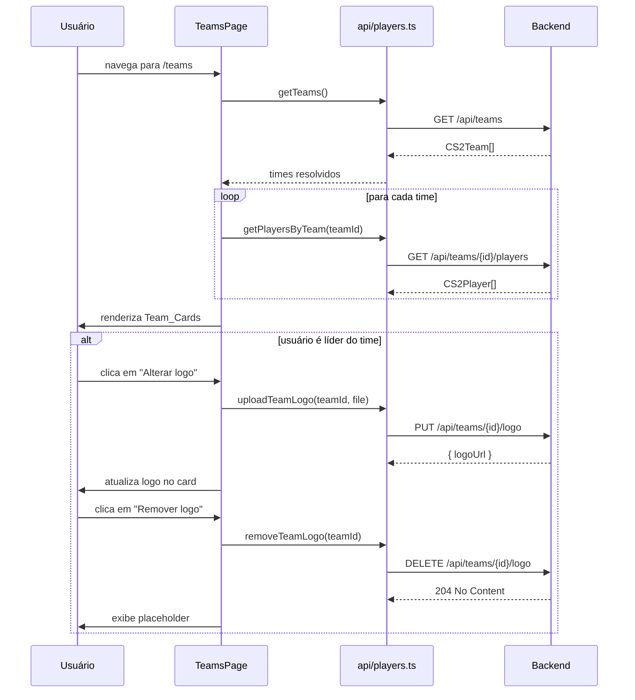

# Design Document — teams-menu

## Overview

Feature que adiciona uma página `/teams` à plataforma FrogBets. A página exibe todos os times de CS2 cadastrados, cada um com sua logo, nome e lista de jogadores. O acesso é protegido por autenticação (mesmo padrão das demais rotas).

O backend requer duas alterações:
1. `GET /api/players` atualmente exige `IsAdmin` — será criado um novo endpoint `GET /api/teams/{id}/players` acessível por qualquer usuário autenticado, ou o endpoint existente será liberado para todos os autenticados.
2. Novos endpoints `PUT /api/teams/{id}/logo` e `DELETE /api/teams/{id}/logo` para upload e remoção de logo, restritos ao líder do time.

## Architecture

A feature segue o padrão já estabelecido no projeto, com adições no backend:

```
Navbar.tsx              ← adiciona link "Times" → /teams
App.tsx                 ← registra rota /teams dentro de <ProtectedRoute>
TeamsPage.tsx           ← nova página (frontend/src/pages/)
api/players.ts          ← funções getTeams() e getPlayersByTeam() (nova ou ajustada)
TeamsController.cs      ← novos endpoints: GET /api/teams/{id}/players,
                           PUT /api/teams/{id}/logo, DELETE /api/teams/{id}/logo
```

Fluxo de dados:



As chamadas de times e jogadores são feitas em paralelo via `Promise.all` quando possível.

## Components and Interfaces

### Backend: TeamsController.cs (modificação)

Adicionar três novos endpoints:

**GET /api/teams/{id}/players** — qualquer usuário autenticado:
```csharp
[HttpGet("{teamId:guid}/players")]
[Authorize]
public async Task<IActionResult> GetPlayersByTeam(Guid teamId)
{
    var players = await _playerService.GetPlayersByTeamAsync(teamId);
    return Ok(players);
}
```

**PUT /api/teams/{id}/logo** — restrito ao líder do time:
```csharp
[HttpPut("{teamId:guid}/logo")]
[Authorize]
public async Task<IActionResult> UpdateLogo(Guid teamId, [FromBody] UpdateLogoBody body)
{
    if (!await IsLeaderOfTeam(teamId)) return Forbid();
    var team = await _teamService.UpdateLogoAsync(teamId, body.LogoUrl);
    return Ok(team);
}
```

**DELETE /api/teams/{id}/logo** — restrito ao líder do time:
```csharp
[HttpDelete("{teamId:guid}/logo")]
[Authorize]
public async Task<IActionResult> RemoveLogo(Guid teamId)
{
    if (!await IsLeaderOfTeam(teamId)) return Forbid();
    await _teamService.UpdateLogoAsync(teamId, null);
    return NoContent();
}
```

Helper de verificação de líder (consulta ao banco, não via claim — conforme padrão de segurança do projeto):
```csharp
private async Task<bool> IsLeaderOfTeam(Guid teamId)
{
    var sub = User.FindFirstValue(ClaimTypes.NameIdentifier) ?? User.FindFirstValue("sub");
    if (!Guid.TryParse(sub, out var userId)) return false;
    return await _db.Users.AsNoTracking()
        .AnyAsync(u => u.Id == userId && u.IsTeamLeader && u.TeamId == teamId);
}
```

`UpdateLogoBody`:
```csharp
public record UpdateLogoBody(string? LogoUrl);
```

### Navbar.tsx (modificação)

Adicionar um `<Link>` com texto "Times" apontando para `/teams`, seguindo o mesmo padrão dos links existentes:

```tsx
<Link to="/teams" onClick={closeMenu}>Times</Link>
```

Posicionamento: após "Ranking CS2" e antes do bloco admin.

### App.tsx (modificação)

Registrar a nova rota dentro do bloco `<ProtectedRoute>`:

```tsx
import TeamsPage from './pages/TeamsPage'
// ...
<Route path="/teams" element={<TeamsPage />} />
```

### TeamsPage.tsx (novo)

Página principal. Responsabilidades:
- Buscar times via `getTeams()`
- Para cada time, buscar jogadores via `getPlayersByTeam(teamId)` (em paralelo via `Promise.all`)
- Gerenciar estados: `loading`, `error`, `teams`, `playersByTeam`
- Detectar se o usuário autenticado é líder de algum time (via JWT claim ou campo retornado pela API)
- Renderizar um `Team_Card` por time, passando `isLeader` quando aplicável

Interface interna:

```tsx
interface State {
  teams: CS2Team[]
  playersByTeam: Record<string, CS2Player[]>
  loading: boolean
  error: string | null
}
```

### Team_Card (inline em TeamsPage)

Componente visual para cada time. Recebe:

```tsx
interface TeamCardProps {
  team: CS2Team
  players: CS2Player[]
  isLeader: boolean          // true se o usuário autenticado é líder deste time
  onLogoUpdate: (teamId: string, logoUrl: string | null) => void
}
```

Renderiza:
- Logo do time (img com `src={team.logoUrl}`) ou placeholder emoji `🐸` quando `logoUrl` é nulo/vazio
- Nome do time (`<h2>`)
- Lista de jogadores: foto (img ou placeholder) + nickname
- Mensagem "Nenhum jogador cadastrado." quando `players` é vazio
- Se `isLeader === true`: botão "Alterar logo" (input file) e, quando há logo, botão "Remover logo"

## Data Models

Os tipos já estão definidos em `frontend/src/api/players.ts` e são reutilizados sem alteração:

```typescript
// Já existente em frontend/src/api/players.ts
export interface CS2Team {
  id: string
  name: string
  logoUrl?: string | null
  createdAt: string
}

export interface CS2Player {
  id: string
  nickname: string
  realName?: string
  teamId: string | null
  teamName: string | null
  photoUrl?: string
  playerScore: number
  matchesCount: number
  createdAt: string
  username?: string
}
```

As funções de API existentes são mantidas. Adicionar as novas:

```typescript
export const getPlayersByTeam = (teamId: string): Promise<CS2Player[]> =>
  apiClient.get<CS2Player[]>(`/teams/${teamId}/players`).then(r => r.data)

export const uploadTeamLogo = (teamId: string, logoUrl: string): Promise<CS2Team> =>
  apiClient.put<CS2Team>(`/teams/${teamId}/logo`, { logoUrl }).then(r => r.data)

export const removeTeamLogo = (teamId: string): Promise<void> =>
  apiClient.delete(`/teams/${teamId}/logo`).then(() => undefined)
```

> Nota: o upload de logo nesta implementação recebe uma URL (string) em vez de um arquivo binário, mantendo consistência com o campo `logoUrl` já existente em `CS2Team` e com o endpoint `POST /api/teams` que já aceita `logoUrl`. Se futuramente for necessário upload de arquivo binário (multipart/form-data), isso seria uma evolução separada.

Agrupamento de jogadores por time (lógica em TeamsPage, mantida para compatibilidade):

```typescript
const playersByTeam = players.reduce<Record<string, CS2Player[]>>((acc, p) => {
  if (!p.teamId) return acc
  acc[p.teamId] = [...(acc[p.teamId] ?? []), p]
  return acc
}, {})
```

## Correctness Properties

*A property is a characteristic or behavior that should hold true across all valid executions of a system — essentially, a formal statement about what the system should do. Properties serve as the bridge between human-readable specifications and machine-verifiable correctness guarantees.*

Esta feature é frontend React com lógica de renderização e agrupamento de dados. PBT é aplicável para as propriedades de renderização (dado que o input varia: listas de times e jogadores com tamanhos e conteúdos arbitrários) e para a lógica de agrupamento (função pura).

### Property 1: Correspondência entre times e cards renderizados

*For any* lista de times retornada pela API (incluindo lista vazia), o número de Team_Cards renderizados na TeamsPage deve ser exatamente igual ao número de times na lista.

**Validates: Requirements 3.3, 4.3**

### Property 2: Nome e logo do time são exibidos corretamente

*For any* time com nome e logoUrl arbitrários, o Team_Card deve exibir o nome do time no DOM; se `logoUrl` for preenchido, deve haver uma `` com esse src; se `logoUrl` for nulo ou vazio, deve haver um placeholder visual no lugar.

**Validates: Requirements 3.4, 3.5, 3.6**

### Property 3: Jogadores do time são exibidos corretamente

*For any* time e qualquer lista de jogadores associados a ele, o Team_Card deve exibir o nickname de cada jogador; se `photoUrl` for preenchido, deve haver uma `` com esse src; se a lista for vazia, deve exibir "Nenhum jogador cadastrado."

**Validates: Requirements 3.7, 3.8, 3.9**

### Property 4: Agrupamento de jogadores por time é correto

*For any* lista de jogadores com `teamId` arbitrários, a função de agrupamento deve produzir um mapa onde cada chave contém exatamente os jogadores cujo `teamId` corresponde a essa chave, e jogadores sem `teamId` não aparecem em nenhum grupo.

**Validates: Requirements 3.1, 3.7**

### Property 5: Controles de logo visíveis apenas para o líder do time

*For any* time e qualquer estado de autenticação, os botões de upload e remoção de logo devem estar presentes no DOM apenas quando `isLeader === true` para aquele time específico; quando `isLeader === false`, esses controles não devem existir no DOM.

**Validates: Requirements 5.1, 5.2, 5.7**

## Error Handling

| Cenário | Comportamento |
|---|---|
| `GET /api/teams` falha (rede, 4xx, 5xx) | Exibe `<p role="alert">Erro ao carregar times.</p>` |
| `GET /api/teams/{id}/players` falha | Exibe `<p role="alert">Erro ao carregar jogadores.</p>` |
| Ambas falham | Exibe mensagem de erro (a primeira capturada pelo `Promise.all`) |
| API retorna lista vazia de times | Exibe `<div className="card empty-card"><p>Nenhum time cadastrado.</p></div>` |
| Time sem jogadores | Team_Card exibe "Nenhum jogador cadastrado." |
| `logoUrl` nulo/vazio | Placeholder visual (emoji ou div com classe CSS) |
| `photoUrl` nulo/vazio | Placeholder visual para o jogador |
| `PUT /api/teams/{id}/logo` falha | Exibe mensagem de erro no card; logo anterior permanece |
| `DELETE /api/teams/{id}/logo` falha | Exibe mensagem de erro no card; logo anterior permanece |
| `PUT /api/teams/{id}/logo` retorna 403 | Exibe mensagem de erro; botões de logo são ocultados |

O padrão de tratamento de erro segue `PlayersRankingPage` e `LeaderboardPage`: estado `error` string + `role="alert"`.

## Testing Strategy

### Abordagem dual

- **Testes de exemplo** (Vitest + Testing Library + MSW): comportamentos específicos, estados de UI, interações
- **Testes de propriedade** (fast-check via Vitest): propriedades universais de renderização e lógica de agrupamento

### Biblioteca PBT

**fast-check** — já disponível no ecossistema npm, integra nativamente com Vitest, sem dependências adicionais de setup.

```bash
npm install --save-dev fast-check
```

Cada property test deve rodar mínimo 100 iterações (padrão do fast-check).

### Testes de exemplo (Vitest)

Arquivo: `frontend/src/pages/TeamsPage.test.tsx`

- Renderiza mensagem de carregamento enquanto APIs estão pendentes
- Renderiza mensagem de erro quando `GET /api/teams` falha
- Renderiza mensagem de erro quando `GET /api/teams/{id}/players` falha
- Renderiza "Nenhum time cadastrado." quando API retorna lista vazia
- Link "Times" está presente na Navbar quando autenticado
- Rota `/teams` redireciona para `/login` quando não autenticado
- Botões de logo visíveis quando `isLeader === true`
- Botões de logo ausentes quando `isLeader === false`
- Atualiza logo no card após upload bem-sucedido
- Exibe placeholder após remoção de logo bem-sucedida

### Testes de propriedade (fast-check)

Arquivo: `frontend/src/pages/TeamsPage.test.tsx` (mesma suite)

**Property 1** — Correspondência times/cards:
```
// Feature: teams-menu, Property 1: número de cards = número de times
fc.assert(fc.asyncProperty(fc.array(arbTeam), async (teams) => {
  // mockar API, renderizar, contar cards
  expect(screen.getAllByRole('article').length).toBe(teams.length)
}))
```

**Property 2** — Nome e logo:
```
// Feature: teams-menu, Property 2: nome e logo exibidos corretamente
fc.assert(fc.asyncProperty(arbTeam, async (team) => {
  // verificar nome no DOM e presença/ausência de img
}))
```

**Property 3** — Jogadores no card:
```
// Feature: teams-menu, Property 3: jogadores exibidos corretamente
fc.assert(fc.asyncProperty(arbTeam, fc.array(arbPlayer), async (team, players) => {
  // verificar nicknames e fotos
}))
```

**Property 4** — Agrupamento puro (sem renderização):
```
// Feature: teams-menu, Property 4: agrupamento de jogadores por time
fc.assert(fc.property(fc.array(arbPlayer), (players) => {
  const grouped = groupPlayersByTeam(players)
  // verificar invariantes do agrupamento
}))
```

**Property 5** — Controles de logo visíveis apenas para o líder:
```
// Feature: teams-menu, Property 5: controles de logo visíveis apenas para o líder
fc.assert(fc.asyncProperty(arbTeam, fc.boolean(), async (team, isLeader) => {
  // renderizar Team_Card com isLeader
  // verificar presença/ausência dos botões de logo
}))
```

### Testes E2E (Cypress)

Arquivo: `frontend/cypress/e2e/teams.cy.ts`

- Fluxo completo: login → clicar em "Times" → verificar que a página carrega com times
- Verificar que `/teams` sem autenticação redireciona para `/login`
- Fluxo de líder: login como líder → verificar botões de logo visíveis no card do seu time → botões ausentes nos outros times
