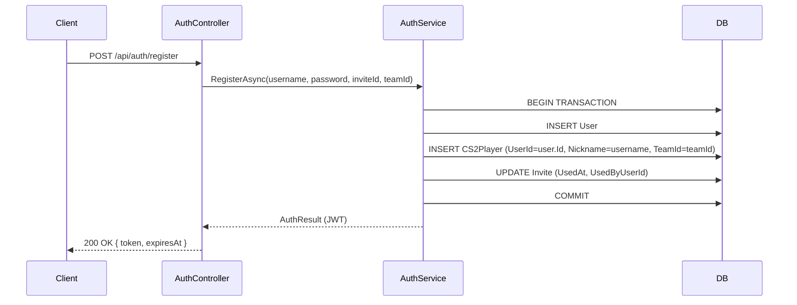

# Design Document — user-player-unification

## Overview

Esta feature unifica `User` e `CS2Player` em um fluxo único: ao se registrar via convite, um `CS2Player` é criado automaticamente na mesma transação. A criação manual de jogadores pelo admin é removida. A seção "Jogadores" do painel admin passa a ser somente leitura, exibindo o `Username` do `User` vinculado. Dados legados (CS2Players sem `UserId`) continuam funcionando sem alteração.

A mudança central é a adição de uma FK nullable `UserId` na entidade `CS2Player`, com constraint `UNIQUE` para valores não-nulos. O `AuthService.RegisterAsync` passa a criar o `CS2Player` na mesma transação do `User`.

---

## Architecture

O fluxo de registro passa a ser:



Se qualquer passo falhar, a transação é revertida e nenhuma entidade é persistida.

O `POST /api/players` é removido. O `GET /api/players` passa a retornar `Username` do `User` vinculado. O ranking continua usando `Nickname` do `CS2Player`.

---

## Components and Interfaces

### Backend

**`CS2Player` (entidade — `FrogBets.Domain`)**

Adicionar campo `UserId` (nullable) e navigation property `User`:

```csharp
public Guid? UserId { get; set; }
public User? User { get; set; }
```

**`IPlayerService` (interface — `FrogBets.Api/Services`)**

- Remover `CreatePlayerAsync` da interface pública.
- Adicionar `Username` (nullable) ao `CS2PlayerDto`.
- `PlayerRankingItemDto` permanece inalterado (usa `Nickname`).

```csharp
public record CS2PlayerDto(
    Guid Id, string Nickname, string? RealName, Guid TeamId, string TeamName,
    string? PhotoUrl, double PlayerScore, int MatchesCount, DateTime CreatedAt,
    string? Username);  // novo campo

public interface IPlayerService
{
    Task<IReadOnlyList<CS2PlayerDto>> GetPlayersAsync();
    Task<IReadOnlyList<PlayerRankingItemDto>> GetRankingAsync();
}
```

**`IAuthService` / `AuthService`**

`RegisterAsync` passa a criar o `CS2Player` na mesma transação. A assinatura pública não muda.

Internamente, `RegisterAsync` usa uma transação explícita:

```csharp
await using var tx = await _db.Database.BeginTransactionAsync();
// INSERT User
// INSERT CS2Player
// UPDATE Invite
await tx.CommitAsync();
```

Se `teamId` for nulo, o `CS2Player` não pode ser criado (TeamId é obrigatório). Neste caso, o registro prossegue sem criar o `CS2Player` — compatibilidade com usuários sem time.

**`PlayersController`**

- `POST /api/players` → removido (retorna `404 Not Found` ou o método é deletado).
- `GET /api/players` → retorna `CS2PlayerDto` com campo `Username`.
- `GET /api/players/ranking` → inalterado.
- `POST /api/players/{id}/stats` → inalterado.
- `GET /api/players/{id}/stats` → inalterado.

### Frontend

**`frontend/src/api/players.ts`**

- Adicionar campo `username?: string` ao tipo `CS2Player`.
- Remover a função `createPlayer`.

**`frontend/src/pages/AdminPage.tsx` — `PlayersSection`**

- Remover o formulário de criação de jogadores.
- Exibir `username` do User vinculado na tabela de jogadores.
- Exibir `username` como identificador principal no seletor de jogadores da seção de stats.

---

## Data Models

### Migração EF Core

Nova coluna `UserId` (nullable, FK para `Users`, UNIQUE para não-nulos):

```sql
ALTER TABLE "CS2Players"
ADD COLUMN "UserId" uuid NULL;

ALTER TABLE "CS2Players"
ADD CONSTRAINT "FK_CS2Players_Users_UserId"
    FOREIGN KEY ("UserId") REFERENCES "Users"("Id") ON DELETE SET NULL;

CREATE UNIQUE INDEX "IX_CS2Players_UserId"
    ON "CS2Players"("UserId")
    WHERE "UserId" IS NOT NULL;
```

A constraint `UNIQUE` com filtro `WHERE "UserId" IS NOT NULL` garante que múltiplos registros legados com `UserId = NULL` são permitidos, mas cada `User` só pode ter um `CS2Player`.

### Configuração EF Core (`OnModelCreating`)

```csharp
modelBuilder.Entity<CS2Player>(e =>
{
    // ... configurações existentes ...

    e.HasOne(p => p.User)
        .WithOne()
        .HasForeignKey<CS2Player>(p => p.UserId)
        .OnDelete(DeleteBehavior.SetNull)
        .IsRequired(false);

    e.HasIndex(p => p.UserId)
        .IsUnique()
        .HasFilter("\"UserId\" IS NOT NULL");
});
```

### DTOs atualizados

| Campo | Antes | Depois |
|---|---|---|
| `CS2PlayerDto.Username` | — | `string?` (nullable) |
| `PlayerRankingItemDto` | inalterado | inalterado |

---

## Correctness Properties

*A property is a characteristic or behavior that should hold true across all valid executions of a system — essentially, a formal statement about what the system should do. Properties serve as the bridge between human-readable specifications and machine-verifiable correctness guarantees.*

### Property 1: Registro cria CS2Player com dados corretos

*Para qualquer* username válido e teamId válido, ao registrar um usuário com sucesso, deve existir exatamente um `CS2Player` no banco com `Nickname == username`, `UserId == user.Id`, `PlayerScore == 0.0` e `MatchesCount == 0`.

**Validates: Requirements 1.1, 1.2, 1.4, 1.5**

### Property 2: CS2Player vinculado expõe Username no DTO

*Para qualquer* `CS2Player` com `UserId` não-nulo, `GetPlayersAsync()` deve retornar um DTO onde `Username == user.Username`.

**Validates: Requirements 2.4, 4.3**

### Property 3: Ranking usa Nickname, não Username

*Para qualquer* conjunto de jogadores (com ou sem `UserId`), `GetRankingAsync()` deve retornar itens onde o identificador público é o `Nickname` do `CS2Player`, não o `Username` do `User`.

**Validates: Requirements 4.4**

### Property 4: Jogadores legados aparecem nas listagens

*Para qualquer* conjunto de `CS2Players` incluindo registros com `UserId = null`, `GetPlayersAsync()` e `GetRankingAsync()` devem retornar todos os jogadores sem lançar exceção.

**Validates: Requirements 5.2, 5.3**

---

## Error Handling

| Situação | Comportamento |
|---|---|
| Falha ao criar `CS2Player` durante registro | Transação revertida; `User` não persiste; retorna `REGISTRATION_FAILED` |
| `POST /api/players` chamado | `404 Not Found` |
| Tentativa de criar segundo `CS2Player` para mesmo `User` | `PlayerService` lança `PLAYER_ALREADY_EXISTS_FOR_USER` |
| `CS2Player` legado sem `UserId` consultado | DTO retorna `Username = null`, sem exceção |
| Registro sem `TeamId` | `CS2Player` não é criado; `User` é criado normalmente |

**Novo código de erro:**

| Código | Contexto |
|---|---|
| `REGISTRATION_FAILED` | Falha atômica no registro (User + CS2Player) |
| `PLAYER_ALREADY_EXISTS_FOR_USER` | Tentativa de criar segundo CS2Player para o mesmo User |

---

## Testing Strategy

### Testes unitários (xUnit + InMemory DB)

- Registro com `teamId` válido → `CS2Player` criado com campos corretos
- Registro sem `teamId` → `User` criado, `CS2Player` não criado
- Falha simulada na criação do `CS2Player` → `User` não persiste (rollback)
- `GetPlayersAsync()` com jogadores vinculados → `Username` presente no DTO
- `GetPlayersAsync()` com jogadores legados → `Username = null`, sem exceção
- Tentativa de criar segundo `CS2Player` para mesmo `User` → `PLAYER_ALREADY_EXISTS_FOR_USER`
- Múltiplos `CS2Players` com `UserId = null` → sem violação de constraint

### Testes de propriedade (FsCheck)

A biblioteca de PBT é **FsCheck** (já utilizada no projeto).

Cada teste de propriedade deve rodar com `MaxTest = 100`.

Tag format: `// Feature: user-player-unification, Property N: <texto>`

**Property 1 — Registro cria CS2Player com dados corretos**
```csharp
// Feature: user-player-unification, Property 1: registro cria CS2Player com dados corretos
[Property(MaxTest = 100)]
public Property RegistroCriaPlayerComDadosCorretos()
{
    return Prop.ForAll(
        Arb.From(Gen.Elements(/* usernames válidos aleatórios */)),
        async username => {
            // Registrar usuário com teamId válido
            // Verificar CS2Player.Nickname == username
            // Verificar CS2Player.UserId == user.Id
            // Verificar CS2Player.PlayerScore == 0.0
            // Verificar CS2Player.MatchesCount == 0
        });
}
```

**Property 2 — CS2Player vinculado expõe Username no DTO**
```csharp
// Feature: user-player-unification, Property 2: CS2Player vinculado expõe Username no DTO
[Property(MaxTest = 100)]
public Property PlayerVinculadoExpoesUsername() { ... }
```

**Property 3 — Ranking usa Nickname**
```csharp
// Feature: user-player-unification, Property 3: ranking usa Nickname, não Username
[Property(MaxTest = 100)]
public Property RankingUsaNickname() { ... }
```

**Property 4 — Jogadores legados aparecem nas listagens**
```csharp
// Feature: user-player-unification, Property 4: jogadores legados aparecem nas listagens
[Property(MaxTest = 100)]
public Property JogadoresLegadosAparecem() { ... }
```

### Testes E2E (Cypress) — não necessários para esta feature

As mudanças no frontend são de remoção de formulário e adição de coluna na tabela. Os testes E2E existentes em `players-ranking.cy.ts` continuam válidos.
